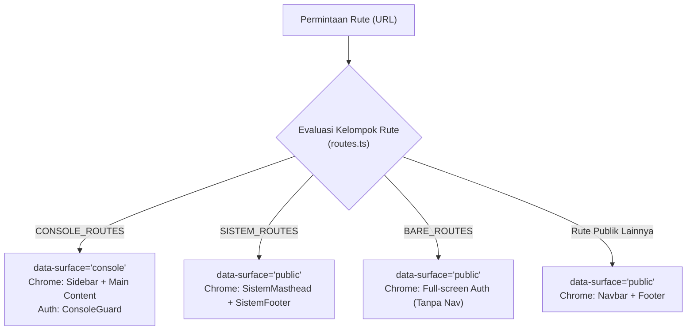

# PRAKIRA Design System — "Buletin"

**Sistem visual dan arsitektur antarmuka untuk platform peringatan dini kesehatan-iklim.**
Pendamping [`PRD.md`](./PRD.md) · Versi 2.6 · 28 Agustus 2026

> **Status dokumen.** Dokumen ini adalah **sumber kebenaran tunggal (ground truth)** representasi 100% frontend PRAKIRA (`frontend/src`).
> Setiap token, permukaan, komponen, rute, aturan aksesibilitas, dan status drift yang tertulis di sini diverifikasi langsung terhadap kode: `frontend/tailwind.config.ts`, `frontend/src/app/globals.css`, `frontend/src/lib/`, dan seluruh komponen di `frontend/src/components/`.
>
> Urutan kebenaran: `tailwind.config.ts` → `globals.css` → `DESIGN-SYSTEM.md` / `design.md`.

---

## 0. Ringkasan Evolusi (v1.0 → v2.0 → v2.6)

| # | Aspek | v1.0 (Rencana) | v2.6 (Terkirim & Terverifikasi) | Alasan Desain |
|---|---|---|---|---|
| 1 | **Typeface** | Dua: Inter + IBM Plex Mono | **Satu**: Inter. `font-mono` dan `font-display` dialiaskan ke Inter | Angka bertabulasi Inter (`tabular-nums`) sudah menutup peran mono. Satu font = satu unduhan, LCP portal warga optimal |
| 2 | **Ramp Risiko** | Klinis (`#1B6B4F / #A8690C / #A32B1F`) | Ramp **Tanah**: `#1F5132 / #D4933A / #A8442C / #8A2E1A / #5A6C6E` | Nada tanah menyatu dengan kanvas publik tanpa kehilangan urutan gelap-terang |
| 3 | **Label Risiko** | Rendah / Sedang / Tinggi | **Rendah / Waspada / Siaga** (+ `KLB` & `Data tidak memadai`) | Terminologi operasional dinas kesehatan, bukan istilah statistik abstrak |
| 4 | **Gradien** | "Dilarang" | Keluarga `bg-grad-*` resmi dari token palet | Gradien diperbolehkan selama **semua perhentian memakai hex palet** (tanpa hue asing) |
| 5 | **Gerak & Animasi** | Statis tanpa gerak | Dua anggaran: **Konsol tenang** vs **Landing bertekstur** | Konsol mengutamakan efisiensi kognitif; Landing memakai lapisan aurora, marquee, beacon, reveal |
| 6 | **Arsitektur Permukaan** | Satu permukaan hangat | **Dual-Surface** (`data-surface="console"` vs `data-surface="public"`) | Kedalaman kanvas dan densitas membedakan konsol nakes dari portal warga |
| 7 | **Tombol** | Radius 10px, tinggi maks 44px | Pil penuh (`rounded-full`), tinggi 40/48/56/64px, bobot 600 | Target sentuh mobile ≥44px dan keterbacaan proyektor saat koordinasi darurat |
| 8 | **Efek Kaca** | `liquid-glass*` dengan backdrop-filter | Datar / Flat di komponen inti, dirapikan | Efek blur berat dihilangkan dari antarmuka nakes demi performa |
| 9 | **Kejujuran Metrik** | Angka tunggal | Wajib rentang prediksi (`lower–upper`) + tingkat cakupan data (`coverage`) | Menghindari ilusi kepastian; model probabilistic wajib menampilkan rentang ketidakpastian |
| 10 | **Transparansi Model** | Tersembunyi di analitik | Rute publik `/model` mandiri (M8 / PRD §5.7) | Uji model, walk-forward blind test curve, cakupan data 16 kecamatan, dan batasan terbuka bagi publik |

---

## 1. Posisi & Prinsip Desain

PRAKIRA bukan aplikasi SaaS komersial dan bukan dashboard generik. Ini adalah **instrumen kerja kesehatan publik** yang juga memiliki wajah ramah bagi warga Kota Semarang. Referensi estetika utamanya adalah buletin meteorologi, arsip epidemiologi, dan jurnalisme data presisi.

Nama sistem: **Buletin**.

### Enam Prinsip Inti

1. **Warna adalah data.** Satu-satunya elemen dengan saturasi tinggi di layar adalah indikator tingkat risiko dan variabel iklim. Merek, latar belakang, dan navigasi bersuara netral.
2. **Angka adalah pahlawannya.** Angka memakai format tabular bertanda (`tabular-nums`), nol bergaris (`slashed-zero`), dan satuan yang tidak ikut membesar.
3. **Menahan diri = Berwibawa.** Bayangan bertingkat halus (maksimal 3 lapis tinta merek). Tidak ada hue liar di luar palet.
4. **Ketidakpastian selalu ditampilkan.** Setiap angka prediksi wajib menyertakan interval rentang (`kasus_prediksi_lower`–`kasus_prediksi_upper`) dan tingkat kelengkapan data historis (`high` / `medium` / `low` / `insufficient`).
5. **Dua permukaan, satu sistem.** Konsol dan Portal Publik memakai token yang sama dengan kedalaman kanvas, padding, dan densitas baris yang disesuaikan untuk peran masing-masing.
6. **Bisa dibaca dalam monokrom (Grayscale Resilient).** Kelas risiko dibedakan oleh gradasi luminansi yang menurun monoton dari Rendah ke Siaga, didukung ikon dan label teks (WCAG 1.4.1).

---

## 2. Token Warna

Semua token warna terpusat di `frontend/tailwind.config.ts`. Dilarang menuliskan kode hex mentah di dalam komponen JSX.

### 2.1 Netral — Ramp "Kertas" (`paper-*`)
Ramp kustom pada hue ±192° dengan kroma sangat rendah.

| Token | Hex | Penerapan UI | Kontras |
|---|---|---|---|
| `paper-0` | `#FFFFFF` | Permukaan kartu, panel, dialog modal | 21:1 di atas teks hitam |
| `paper-50` | `#F5F7F7` | Kanvas aplikasi konsol (`--canvas` console) | — |
| `paper-100` | `#ECF0F0` | Permukaan cekung, header tabel, well, badge netral | — |
| `paper-200` | `#DFE6E6` | Garis batas baku / hairline border (`--border`) | — |
| `paper-300` | `#C9D4D4` | Garis batas tegas, pemisah aktif (`--border-strong`) | — |
| `paper-400` | `#A3B2B3` | Sumbu grafik Recharts, gridline, dekorasi non-teks | Bukan warna teks |
| `paper-500` | `#7C8D8F` | Ikon pelengkap, dekorasi sekunder | Bukan warna teks |
| `paper-600` | `#5A6C6E` | Teks tersier, caption, muted foreground (Lantai WCAG AA) | 4.95:1 s.d. 5.1:1 |
| `paper-700` | `#3D4E50` | Teks sekunder, deskripsi kartu, isi tabel | 7.8:1 di atas putih |
| `paper-800` | `#24373A` | Subjudul tebal, judul kartu | 11.2:1 di atas putih |
| `paper-900` | `#0E2225` | Teks utama / tinta hitam (foreground) | 16.5:1 di atas putih |

### 2.2 Merek — "Petrol" (`brand-*`)

| Token | Hex | Penerapan UI |
|---|---|---|
| `brand-900` | `#06282F` | Latar navbar gelap, masthead instansi, sidebar konsol |
| `brand-800` | `#093843` | Status aktif tombol primer |
| `brand-700` | `#0B4A57` | **Primary Brand** — tombol utama, ikon aktif, brand DEFAULT |
| `brand-600` | `#0F5F6E` | Status hover tombol primer |
| `brand-500` | `#17808F` | Tautan aktif, deret utama tren prediksi |
| `brand-300` | `#7FB8C0` | Border aksen lembut, ring fokus sekunder |
| `brand-100` | `#D6E9EC` | Isian chip, eyebrow, lencana brand |
| `brand-50` | `#EAF4F5` | Latar blok tersorot, hover baris tabel aktif |

### 2.3 Ramp Risiko — "Sinyal Tanah" (`risk-*`)
Satu-satunya kategori warna jenuh di seluruh aplikasi.

| Tingkat | Label UI | Teks (`risk-*`) | Latar (`-bg`) | Border (`-br`) | Isian Peta (`-fill`) | Ikon Terikat |
|---|---|---|---|---|---|---|
| `low` | **Rendah** | `#1F5132` | `#EDF4EC` | `#C5DEC2` | `#7AA876` | `ShieldCheck` |
| `medium` | **Waspada** | `#D4933A` | `#FDF6E9` | `#F6DBA9` | `#E5AA52` | `AlertTriangle` |
| `high` | **Siaga** | `#A8442C` | `#FBECE8` | `#F3C2B4` | `#C95E42` | `Siren` (+ hatch) |
| `critical` | **KLB** | `#8A2E1A` | `#F9DFD8` | `#E8A28E` | `#A8442C` | `AlertOctagon` |
| `none` | **Data tidak memadai** | `#5A6C6E` | `#ECF0F0` | `#DFE6E6` | `#E3E8E8` | `CircleSlash` |

**Aturan Ramp Risiko:**
- Luminansi menurun monoton dari `low` ke `critical`, menjamin pembedaan kontras pada penglihatan monokrom atau cetakan fisik.
- Kelas `high` (Siaga) di peta choropleth dilengkapi tekstur arsiran diagonal 45° (`.risk-hatch` / `bg-hatch`) untuk pembedaan instan bagi penderita protanopia/deuteranopia.
- `Data tidak memadai` (`none` / `insufficient`) adalah kelas independen dan **tidak boleh** diturunkan secara diam-diam menjadi "Rendah".

### 2.4 Variabel Iklim (`climate-*`)

| Variabel | Token | Hex | Semantik & Bentuk Grafik |
|---|---|---|---|
| **Curah Hujan** | `climate-rain` | `#2E6F8E` | Akumulasi presipitasi bulanan (mm) → Diagram Batang (Bar) |
| **Suhu Udara** | `climate-temp` | `#B4552A` | Suhu rata-rata bulanan (°C) → Diagram Garis (Line) |
| **Kelembaban** | `climate-humid` | `#4E8C7E` | Kelembaban relatif udara (%) → Diagram Garis (Line) |

Kembaran nilai JavaScript didefinisikan dalam `CLIMATE_COLORS` (`src/lib/utils.ts`) untuk integrasi Recharts.

### 2.5 Warna Kategorikal Grafik (`cat-*`)

| Token | Hex | Peran |
|---|---|---|
| `cat-1` | `#0B4A57` | Deret Observasi / Riwayat Aktual |
| `cat-2` | `#7A5C2E` | Deret Pembanding Sekunder |
| `cat-3` | `#47617F` | Deret Sanitasi Udara / Masker |
| `cat-4` | `#5B4A70` | Deret Kategori Tambahan |
| `cat-5` | `#2C6650` | Deret Intervensi Lingkungan |

*Aturan silang:* Warna risiko tidak pernah digunakan untuk membedakan kategori netral; warna kategorikal tidak pernah mengkodekan tingkat keparahan risiko.

### 2.6 Ramp Permukaan Publik — "Kabut" (`sand-*`)

| Token | Hex | Penerapan UI |
|---|---|---|
| `sand-50` | `#EFF5F9` | Kanvas permukaan publik (`--canvas` public) |
| `sand-100` | `#E3EDF4` | Well dan permukaan cekung publik (`--surface-sunken` public) |
| `sand-200` | `#CFDFE9` | Border permukaan publik (`--border` public) |
| `sand-300` | `#AFC6D5` | Border tegas / aksen permukaan publik (`--border-strong` public) |

### 2.7 Gradien Resmi (`bg-grad-*`)

| Token Gradien | Komposisi Hex Token | Penerapan UI |
|---|---|---|
| `bg-grad-page` | `paper-0` → `sand-50` + kabut petrol | Kanvas halaman publik & landing page |
| `bg-grad-sand` | `sand-50` → `sand-100` | Panel layanan dan kartu portal |
| `bg-grad-paper` | `paper-0` → `paper-50` | Kartu putih bergradasi halus |
| `bg-grad-brand-soft` | `brand-50` → `brand-100` | Blok informasi sorotan penting |
| `bg-grad-risk-low` | `risk-low-bg` → `#FFFFFF` | Latar kartu laporan sukses / status aman |
| `bg-grad-risk-medium` | `risk-medium-bg` → `#FFFFFF` | Latar kartu status waspada |
| `bg-grad-risk-high` | `risk-high-bg` → `#FFFFFF` | Latar kartu status siaga |
| `bg-grad-bar-{level}` | Gradien bar visualisasi R² | Bar kalibrasi evaluasi model |

---

## 3. Arsitektur Dua Permukaan (Dual-Surface Architecture)

PRAKIRA membagi antarmukanya ke dalam dua mode permukaan visual melalui atribut `data-surface` pada tag `<html>`.



### 3.1 Variabel CSS per Permukaan

| Parameter | Konsol (`data-surface="console"`) | Publik (`data-surface="public"`) |
|---|---|---|
| `--canvas` | `#F5F7F7` (`paper-50`) | `#EFF5F9` (`sand-50`) |
| `--surface-sunken` | `#ECF0F0` (`paper-100`) | `#E3EDF4` (`sand-100`) |
| `--border` | `#DFE6E6` (`paper-200`) | `#CFDFE9` (`sand-200`) |
| `--border-strong` | `#C9D4D4` (`paper-300`) | `#AFC6D5` (`sand-300`) |
| `--row-h` (Tinggi Baris) | `44px` (Kompak & berorientasi data) | `56px` (Lapang & ramah sentuhan) |
| `--card-pad` (Padding Kartu) | `22px` | `28px` |
| `--base-size` | `1.0625rem` (17px pada root 112.5%) | `1.125rem` (18px pada root 112.5%) |

Root font-size ditetapkan pada `112.5%` (1rem = 18px).

### 3.2 Inventaris Lengkap 20 Rute Aplikasi

| # | Rute | Kelompok | Surface | Akses | Chrome | Deskripsi Halaman |
|---|---|---|---|---|---|---|
| 1 | `/` | Publik | `public` | Terbuka | `Navbar` + `Footer` | **Landing Page Utama**: Hero dengan live district checker, timeline preview, HowItWorks, CityPulse, DistrictBoard, Features, CtaBanner |
| 2 | `/dashboard` | `CONSOLE_ROUTES` | `console` | Petugas | `Sidebar` | **Dashboard Prediksi**: Peta choropleth interaktif 16 kecamatan, panel detail wilayah, ranking table, KPI cards, grafik tren kasus |
| 3 | `/tindakan` | `CONSOLE_ROUTES` | `console` | Petugas | `Sidebar` | **Pusat Aksi Dini**: Antrean triase rekomendasi intervensi (fogging, klorinasi, buffer stock, edukasi), modal dispatch SOP, pelacakan tenggat |
| 4 | `/verifikasi` | `CONSOLE_ROUTES` | `console` | Petugas | `Sidebar` | **Antrean Verifikasi**: Validasi laporan warga masuk (Terima 1-klik, Tolak wajib alasan), filter wilayah & status, routing tiket lingkungan |
| 5 | `/analitik` | `CONSOLE_ROUTES` | `console` | Petugas | `Sidebar` | **Analitik & Riwayat**: Grafik korelasi kasus vs iklim (Pearson r + lag), tabel rekapitulasi terurut, evaluasi backtesting, ekspor CSV |
| 6 | `/admin` | `CONSOLE_ROUTES` | `console` | Petugas | `Sidebar` | **Tata Kelola Data**: Unggah & validasi pratinjau CSV kasus per kecamatan, status ingest riil & cakupan dataset, jejak audit (audit trail) |
| 7 | `/masuk` | `BARE_ROUTES` | `public` | Terbuka | Bare | **Autentikasi Petugas**: Formulir masuk nakes dengan httpOnly cookie session, penanganan redirect `?lanjut=` |
| 8 | `/sistem` | `SISTEM_ROUTES` | `public` | Terbuka | `SistemMasthead` + `SistemFooter` | **Portal Layanan & Status Kota**: Navigasi SL-01..SL-06, buletin resmi, peringatan aktif, register terbuka 16 kecamatan (GeoJSON/CSV), feed sistem |
| 9 | `/model` | Publik | `public` | Terbuka | `Navbar` + `Footer` | **Transparansi & Akurasi Model** (M8): Bobot kepentingan fitur, kurva blind test walk-forward, tabel cakupan data 16 kecamatan, batasan model |
| 10 | `/tentang` | Publik | `public` | Terbuka | `Navbar` + `Footer` | **Tentang Platform**: Metodologi epidemiologi-iklim, arsitektur data, institusi pelaksana (Dinkes & BMKG), FAQ |
| 11 | `/hubungi-kami` | Publik | `public` | Terbuka | `Navbar` + `Footer` | **Direktori Darurat & Puskesmas**: Kontak 119 ext 9, direktori lengkap 37 puskesmas se-Kota Semarang (alamat, kontak, jam operasional) |
| 12 | `/warga` | Publik | `public` | Terbuka | `Navbar` + `Footer` | **Portal Warga**: Hub pelaporan dan pemantauan warga dengan `WargaShell` dan penafian non-diagnostik |
| 13 | `/warga/lapor` | Publik | `public` | Terbuka | `Navbar` + `Footer` | **Formulir Laporan Warga**: 5 kategori laporan, kompresi foto & stripping GPS/EXIF di sisi klien, rate-limiting, kode lacak PKR-XXXXXX |
| 14 | `/warga/status` | Publik | `public` | Terbuka | `Navbar` + `Footer` | **Pelacak Status Laporan**: Garis waktu verifikasi publik berdasarkan kode lacak, umpan balik catatan penolakan/persetujuan |
| 15 | `/dev` | Publik | `public` | Terbuka | `Navbar` + `Footer` | **Showcase Komponen & Token**: Halaman pengujian visual komponen UI Buletin |
| 16 | `/mesin-waktu` | Publik | `public` | Terbuka | `Navbar` + `Footer` | **Mesin Waktu**: Putar ulang periode uji model — penggeser bulan, dua peta choropleth berdampingan (prakiraan vs rekap resmi), tabel putusan per kecamatan, rekap sensitivitas & alarm palsu |
| 17 | `/simulasi` | Publik | `public` | Terbuka | `Navbar` + `Footer` | **Simulator Cuaca**: Tiga penggeser iklim (hujan/suhu/kelembaban) yang menghitung ulang prakiraan dan peringkat 16 kecamatan; baris di luar rentang data latih diberi tanda, kalimat pembatas berada di atas penggeser (PRD §5.12) |
| 18 | `/prioritas` | Publik | `public` | Terbuka | `Navbar` + `Footer` | **Prioritas Terdampak**: Peringkat risiko berdampingan dengan peringkat berbobot populasi/kepadatan, kartu "yang belum masuk indeks ini", dan kalkulator biaya tak-bertindak berbasis asumsi pengguna (PRD §5.13, §5.16) |
| 19 | `/tindakan/nota/[id]` | `BARE_ROUTES` | `public` | Terbuka | Bare | **Draf Nota Dinas**: Satu tindakan aksi dini sebagai lembar A4 siap tanda tangan; dicetak lewat mesin cetak peramban (`@media print`, lihat §11.1) |
| 20 | `/buletin` | `BARE_ROUTES` | `public` | Terbuka | Bare | **Buletin Resmi SKDR**: Prakiraan, peringatan, dan rekomendasi satu periode sebagai lembar buletin bernomor; dicetak lewat mesin cetak peramban |

---

## 4. Tipografi

### 4.1 Typeface Tunggal: Inter
Satu font variabel dioptimalkan via `next/font/google` (`--font-sans`).
`font-mono` dan `font-display` dialiaskan ke Inter untuk menjaga efisiensi aset (satu unduhan font) namun tetap menjalankan fungsi semantik pembeda peran.

Fitur OpenType aktif (`globals.css`):
```css
font-feature-settings: "cv05" 1, "cv08" 1, "ss03" 1, "calt" 1;
```
*(Catatan: `cv11` dimatikan agar huruf `a` tetap mempertahankan karakter double-storey yang kokoh).*

### 4.2 Skala Tipografi Sistem (16 Tingkat)

| Token Kelas | Ukuran Font (rem / px ekuivalen) | Line Height | Tracking | Bobot Baku | Penggunaan Utama |
|---|---|---|---|---|---|
| `text-display` | `clamp(2.25rem, 1.6rem + 2.6vw, 3.5rem)` | 1.04 | −0.022em | 600 | H1 Hero landing page |
| `text-h1` | `2.0000rem` (36px) | 1.15 | −0.020em | 600 | Judul utama halaman konsol & buletin |
| `text-h2` | `1.5000rem` (27px) | 1.20 | −0.018em | 600 | Judul seksi utama / Section heading |
| `text-h3` | `1.1250rem` (20.25px) | 1.35 | −0.012em | 600 | Judul kartu, sub-bagian dialog |
| `text-body-lg` | `1.0625rem` (19.125px) | 1.65 | 0 | 400 | Paragraf pembuka / lead text publik |
| `text-body` | `0.9375rem` (16.875px) | 1.60 | 0 | 400 | Paragraf baku konsol & teks konten |
| `text-body-sm` | `0.8750rem` (15.75px) | 1.55 | 0 | 400 | Teks pendukung, isi tabel |
| `text-caption` | `0.8125rem` (14.625px) | 1.45 | 0 | 400 | Keterangan, catatan kaki, help text |
| `text-overline` | `0.6875rem` (12.375px) | 1.40 | +0.080em | 500 | Label kategori huruf besar (uppercase) |
| `text-2xs` | `0.6111rem` (11px) | 1.45 | 0 | 500 | Label mikro tabel padat |
| `text-3xs` | `0.5556rem` (10px) | 1.40 | 0 | 500 | Indikator tag & metadata status |
| `text-4xs` | `0.5000rem` (9px) | 1.40 | 0 | 500 | Keterangan mikro ekstrem pada widget |
| `text-5xs` | `0.4444rem` (8px) | 1.40 | 0 | 500 | Label grafik mikro padat |
| `text-metric-xl`| `2.5000rem` (45px) | 1.00 | −0.020em | 600 | Angka metrik hero / highlight utama |
| `text-metric` | `2.0000rem` (36px) | 1.05 | −0.020em | 600 | Angka utama KPI card & summary tile |
| `text-metric-sm`| `1.3750rem` (24.75px) | 1.10 | −0.010em | 600 | Angka ringkas dalam tabel & modal |

### 4.3 Integrasi `extendTailwindMerge` (`src/lib/utils.ts`)
Agar `tailwind-merge` (`cn()`) tidak salah mengenali nama ukuran font kustom (`text-overline`, `text-metric`, `text-body-sm`, dll.) sebagai warna teks, seluruh 16 skala ukuran terdaftar secara eksplisit:

```typescript
const customTwMerge = extendTailwindMerge({
  extend: {
    classGroups: {
      "font-size": [
        "text-5xs", "text-4xs", "text-3xs", "text-2xs",
        "text-overline", "text-caption", "text-body-sm", "text-body",
        "text-body-lg", "text-h3", "text-h2", "text-h1",
        "text-display", "text-metric-sm", "text-metric", "text-metric-xl",
      ],
    },
  },
});
```

### 4.4 Aturan Bobot Font (Weight Restraint)
- `400` (`font-normal`): Seluruh teks berjalan, paragraf, dan konten deskriptif.
- `500` (`font-medium`): Label antarmuka, kepala tabel (`th`), item navigasi aktif, badge.
- `600` (`font-semibold`): Judul (`h1`–`h3`, `display`), nilai metrik, teks tombol. **Ini adalah batas maksimum.**
- `700+` (`font-bold` / `font-extrabold`): **Dilarang di seluruh codebase.**

---

## 5. Ruang, Radius, dan Bayangan

### 5.1 Radius Sudut (`rounded-*`)

| Token | Nilai | Penggunaan |
|---|---|---|
| `xs` | `4px` | Kotak centang, indikator strip kecil |
| `sm` | `6px` | Tag kecil, chip ringkas |
| `md` / DEFAULT | `8px` | Segmented tab, input field internal |
| `lg` | `10px` | Dropdown select, input kontrol |
| `xl` | `14px` | Kartu baku (`<Card>`), panel modul |
| `2xl` | `18px` | Wadah peta Leaflet, dialog modal, panel detail wilayah |
| `3xl` | `24px` | Hero container, kartu konfirmasi laporan warga |
| `full` | `9999px` | Tombol pil (`<Button>`), badge, chip status |

### 5.2 Bayangan Tinta Merek (`shadow-*`)
Semua bayangan memakai basis warna tinta petrol (`#0E2225`), bukan hitam murni `rgba(0,0,0,...)`.

| Token | Nilai CSS | Peran |
|---|---|---|
| `hairline` | `0 0 0 1px rgba(14,34,37,.06)` | Pemisah baris tabel padat, panel bertetangga |
| `xs` | `0 1px 1px rgba(14,34,37,.04)` | Elemen interaktif ringan |
| `sm` | `0 1px 2px rgba(14,34,37,.05), 0 1px 1px rgba(14,34,37,.03)` | Kartu sekunder |
| `card` | `0 1px 2px rgba(14,34,37,.04), 0 8px 20px -10px rgba(14,34,37,.10)` | Kartu utama & KPI |
| `lift` | `0 2px 4px rgba(14,34,37,.04), 0 18px 36px -14px rgba(14,34,37,.16)` | Menu dropdown, hover kartu interaktif |
| `pop` | `0 4px 8px rgba(14,34,37,.06), 0 28px 56px -20px rgba(14,34,37,.22)` | Dialog modal, tooltip Recharts, toast |
| `focus` | `0 0 0 2px #FFFFFF, 0 0 0 4px rgba(11,74,87,.55)` | Ring fokus aksesibilitas keyboard |

---

## 6. Anggaran Gerak & Animasi

| Permukaan | Filosofi Gerak | Animasi yang Diizinkan |
|---|---|---|
| **Konsol Petugas** | Tenang, stabil, tanpa pergeseran layout | `animate-fade-in`, `animate-fade-in-up`, `animate-pulse-dot` pada indikator real-time. Perubahan data dilakukan dengan crossfade halus tanpa perubahan dimensi. |
| **Landing & Publik** | Halus, mencerminkan atmosfer cuaca | `animate-aurora` (drift 22–28s), `animate-marquee` (strip status), `animate-beacon` (cincin sinyal), `animate-rise-fall` (apung ilustrasi), `animate-grow-x` (pertumbuhan bar), `[data-reveal]` (gulir bertahap). |

**Kepatuhan Aksesibilitas Gerak:**
Pada mode `prefers-reduced-motion: reduce`, seluruh durasi animasi dan transisi dinetralkan ke `0.01ms` di `@layer base` (`globals.css`). Komponen `<Reveal>` langsung memunculkan keadaan akhir tanpa jeda.

---

## 7. Spesifikasi Lengkap Komponen

### 7.1 Tombol (`src/components/ui/button.tsx`)
- **Varian:** `primary` (`bg-brand-700 hover:bg-brand-600 active:bg-brand-800 text-white`), `secondary` (`bg-paper-100 text-paper-800`), `outline` (`border border-paper-300 hover:bg-brand-50`), `ghost` (`hover:bg-paper-100`), `danger` (`bg-risk-high hover:bg-risk-critical text-white`), `link` (`text-brand-500 hover:underline`).
- **Ukuran:** `sm` (40px, text-caption), `default`/`md` (48px, text-body-sm), `lg` (56px, text-body), `xl` (64px, text-body-lg), `icon` (48px), `icon-sm` (40px).
- **Bentuk:** `rounded-full`, bobot `font-semibold` (600).
- **Aturan:** Maksimal 1 tombol primer per layar/modul; dilarang menggunakan `active:scale-*`.

### 7.2 Kartu (`src/components/ui/card.tsx`)
- Permukaan `bg-surface`, border `border-border`, radius `rounded-xl`, padding `var(--card-pad)`.
- Subkomponen: `CardHeader`, `CardTitle` (`text-h3 font-semibold`), `CardDescription` (`text-caption text-paper-600`), `CardContent`, `CardFooter`.

### 7.3 Kartu KPI & Metrik (`src/components/kpi-card.tsx` & `src/components/ui/metric.tsx`)
- Kontrak Kejujuran: Properti `range` (`[lower, upper]`) dan `coverage` (`"high" | "medium" | "low" | "insufficient"`) berstatus **wajib**.
- Bila `coverage === "insufficient"`, kartu merender pesan penjelas eksplisit *"Data historis belum memadai untuk estimasi numerik"* alih-alih angka nol palsu.
- Nilai agregat kota dihitung via `aggregateCoverage()` (`utils.ts`) yang mewarisi tingkat cakupan kecamatan terlemah.

### 7.4 Lencana & Badge (`src/components/ui/badge.tsx`)
- Varian Risiko: `risk-low`, `risk-medium`, `risk-high`, `risk-critical`, `risk-none` (Data tidak memadai).
- Varian Sumber Data: `official` (Data dinas resmi) vs `citizen` (Sinyal warga terverifikasi, border putus-putus) sesuai PRD §7-H4.
- Badge risiko **selalu** membawa ikon dan label teks (WCAG 1.4.1).

### 7.5 Peta Choropleth Wilayah (`src/components/choropleth-map.tsx`)
- Render GeoJSON 16 batas kecamatan Kota Semarang dengan Leaflet.
- Isian poligon sesuai `RISK_CONFIG.fill` dengan garis batas putih 1px.
- Kecamatan berstatus Siaga menampilkan arsiran diagonal `.risk-hatch`.
- Tooltip interaktif menampilkan nama kecamatan, status risiko, prediksi kasus + rentang ketidakpastian, dan cakupan data.

### 7.6 Analitik Kasus & Iklim (`src/components/climate-correlation-chart.tsx` & `src/components/climate-recap-table.tsx`)
- **Grafik Korelasi:** Membandingkan kasus penyakit vs 1 variabel iklim terpilih (`Curah hujan`, `Suhu`, `Kelembaban`) pada sumbu ganda independen. Menampilkan nilai Pearson $r$ terhitung dinamis, jeda waktu (lag bulan), signifikansi statistik, dan jumlah sampel ($n$).
- **Tabel Rekapitulasi:** Tabel drill-down yang dapat diurutkan per kolom (periode, variabel iklim, kasus aktif) dengan bar visualisasi proporsional.

### 7.7 Status Data & Penanganan Error (`src/components/data-state.tsx`)
- Menyatukan 4 keadaan data di satu tempat: `loading` (spinner + teks), `error` (peringatan + tombol coba lagi), `empty` (pesan keadaan kosong yang jujur), dan `children` (render data).
- Menangani keadaan ke-5: `meta.stale` saat gateway mengembalikan data tersimpan terakhir ketika service ML tidak terjangkau.

### 7.8 Pusat Aksi Dini & Triase (`src/components/early-action-center.tsx` & `src/components/action-queue.tsx`)
- Antrean triase rekomendasi intervensi diurutkan berdasarkan: Status (belum selesai) → Tenggat terdekat (`due_date` vs `systemToday`) → Prioritas.
- Summary tiles menampilkan jumlah aksi perlu instruksi, lewat tenggat, warga menunggu perlindungan, dan tenggat terdekat.
- Modal SOP (`DispatchActionModal`) memuat checklist kesiapan lapangan, estimasi dampak tanpa intervensi, draf pesan koordinasi dinas, dan pencatatan nama operator ke jejak audit.

### 7.9 Verifikasi Laporan Warga (`src/components/verification-queue.tsx`)
- Konsol nakes untuk meninjau laporan warga masuk.
- **Terima 1-klik, Tolak wajib alasan minimal 8 karakter** (catatan penolakan dapat dibaca oleh pelapor di halaman status).
- Pengelompokan tiket lingkungan (genangan, sampah liar, saluran tersumbat) dialihkan ke Dinas Lingkungan Hidup sesuai PRD §5.6b.

### 7.10 Portal Warga & Pelaporan (`src/components/warga/shell.tsx`, `citizen-report-form.tsx`, `report-tracker.tsx`)
- `WargaShell` menyertakan banner permanen di bawah konten: *"Ini perkiraan risiko wilayah, bukan diagnosis"* (PRD §5.3 / §11-H3).
- **Formulir Laporan:** 5 kategori, input kecamatan (terisi otomatis dari pilihan sebelumnya), tanggal kejadian, deskripsi singkat (min 15 karakter).
- **Privasi Foto:** Foto pelapor dikompresi dan digambar ulang via HTML5 `<canvas>` di browser sebelum diunggah untuk menghapus seluruh metadata EXIF dan koordinat GPS.
- **Pelacakan Tanpa Akun:** Kode lacak format `PKR-XXXXXX` (alfabet non-ambigu) dengan garis waktu proses real-time.

### 7.11 Transparansi & Akurasi Model (`src/components/model-transparency.tsx` & suite)
- **Ringkasan Model (`ModelSummary`):** Arsitektur ensemble, periode latih, tanggal update, dan bobot kepentingan fitur relatif.
- **Evaluasi Backtesting (`BacktestCard` & `BacktestComparisonChart`):** Kurva blind test time-series bulanan (Kasus Aktual vs Prediksi Model), skor $R^2$, MAE, RMSE, dan akurasi kelas risiko.
- **Cakupan Data 16 Kecamatan (`ModelCoverage`):** Tabel pemetaan kelengkapan data historis seluruh 16 kecamatan (Tinggi, Sedang, Rendah, Tidak memadai).
- **Batasan Model:** Pernyataan formal mengenai keterbatasan data iklim bulanan dan batasan fungsional platform.

### 7.12 Tata Kelola Data & Jejak Audit (`src/components/admin-data-import.tsx`)
- **Impor CSV Kasus:** Pemilihan penyakit, unduhan contoh template CSV (berisi 16 nama kecamatan resmi dengan kolom kasus dikosongkan), validasi pra-unggah, pratinjau 10 baris pertama, dan konfirmasi komit data.
- **Status Ingest Riil:** Informasi pekerjaan ingest terakhir (sumber, waktu selesai, baris diproses, durasi latensi ms) dan tombol hitung ulang prediksi.
- **Jejak Audit Integritas Data (`AuditTrailCard`):** Tabel kronologis peristiwa dari server (login/logout, impor data, verifikasi laporan, eksekusi model) dengan filter status dan pencarian.

### 7.13 Identitas Merek (`src/components/brand-lockup.tsx` & `brand-mark.tsx`)
- Logo House Mark: Bentuk tetesan air hujan yang bertransisi menjadi diagram batang naik (cuaca bertransformasi menjadi data).
- Mark dirender dalam `currentColor` (tidak pernah memakai fill mandiri) dan berdiri telanjang di latar terang tanpa kotak petrol berlebih.

---

## 8. Standar Aksesibilitas (WCAG 2.1 AA)

| Kriteria | Standar & Implementasi PRAKIRA |
|---|---|
| **Kontras Teks Normal** | Rasio kontras $\ge 4.5:1$ (`paper-600` di atas `paper-0` bernilai 5.09:1; di atas `sand-50` bernilai 4.95:1). |
| **Kontras Teks Besar & Ikon** | Rasio kontras $\ge 3.0:1$. |
| **Target Sentuh (Touch Targets)** | Ukuran minimal $44 \times 44\text{ px}$ (tombol publik berukuran 48–56px). |
| **Indikator Fokus Keyboard** | `:focus-visible` global dengan ring bayangan ganda (`shadow-focus`). Dilarang mematikan outline tanpa pengganti visual. |
| **Skip Navigation** | Komponen `SkipLink` di `layout-wrapper.tsx` mengarahkan fokus langsung ke elemen `<main id="konten" tabIndex={-1}>`. |
| **Pengubah Ukuran Teks** | Pilihan ukuran font: Standar (112.5%), Kecil (100%), Besar (125%) via `AccessibilityMenu` dan disimpan di `localStorage` (`prakira.a11y.font`). |
| **Mode Kontras Tinggi** | Mode `html.a11y-contrast` mendefinisikan ulang token CSS variables secara menyeluruh (`prakira.a11y.contrast`). |
| **Indikator Warna Ganda** | Seluruh informasi status dan risiko wajib menyertakan teks dan ikon (WCAG 1.4.1). |

---

## 9. Pemetaan Token ke Variabel Figma

| Koleksi Figma | Token Kode Sumber | Mode Variabel Figma |
|---|---|---|
| `color/primitive` | `paper-*`, `brand-*`, `risk-*`, `climate-*`, `cat-*`, `sand-*` | Default |
| `color/semantic` | `canvas`, `surface`, `surface-sunken`, `border`, `border-strong`, `foreground`, `muted-foreground` | `console` / `public` |
| `space` & `layout` | `row-h`, `card-pad`, `base-size`, basis 4px | `console` / `public` |
| `typography` | 16 skala ukuran teks dari `5xs` hingga `metric-xl` | Inter font family |
| `radius` | `xs` (4px) hingga `3xl` (24px), `full` (9999px) | Default |
| `elevation` | `hairline`, `xs`, `sm`, `card`, `lift`, `pop`, `focus` | Default |

---

## 10. Aturan Implementasi Kode (Engineering Rules)

1. **Dilarang keras menuliskan hex mentah di JSX/TSX.** Semua warna wajib merujuk ke token Tailwind (`bg-brand-700`, `text-paper-900`, `border-border`).
2. **Dilarang menggunakan palet warna bawaan Tailwind** (`emerald-*`, `slate-*`, `rose-*`, `zinc-*`). Palet sistem Buletin sudah lengkap dan mandiri.
3. **Gradien wajib melalui token `bg-grad-*`.** Dilarang meracik gradien inline sembarangan.
4. **Ukuran font wajib menggunakan skala sistem** (`text-body`, `text-h3`, `text-caption`, `text-overline`, `text-2xs`–`text-5xs`), bukan nilai arbitrer seperti `text-[13px]`.
5. **Angka numerik wajib menggunakan angka bertabulasi (`tabular-nums` / `.tabular`).**
6. **Satu tombol primer per modul visual.**
7. **Setiap nilai prediksi model wajib menyertakan interval rentang dan tingkat cakupan data.**
8. **Setiap penambahan ukuran font baru di `tailwind.config.ts` wajib didaftarkan di `extendTailwindMerge` (`src/lib/utils.ts`).**

---

## 11. Daftar Periksa Kepatuhan Desain (Design Compliance Checklist)

- [x] Dual-surface aktif tanpa kedipan visual (`data-surface="console"` vs `"public"`).
- [x] Seluruh 20 rute terintegrasi dengan layout wrapper dan permissions guard yang tepat.
- [x] `prefers-reduced-motion` menetralkan seluruh animasi di level global.
- [x] Seluruh indikator risiko membawa teks + ikon terstandarisasi (`none` tidak jatuh ke "Rendah").
- [x] Arsir diagonal 45° (`.risk-hatch`) aktif pada status Siaga di peta choropleth.
- [x] Tidak ada font-weight `700+` (`font-bold` / `font-extrabold`) di seluruh kode sumber.
- [x] Tidak ada animasi terlarang (`animate-ping`, `animate-bounce`, `active:scale-*`).
- [x] Seluruh kartu KPI dan metrik menampilkan rentang estimasi dan cakupan data historis.
- [x] Judul halaman konsol (`ConsolePageHeader`) sama persis dengan label menu `Sidebar`.
- [x] Nilai korelasi statistik ($r$, lag, signifikansi) dihitung dinamis dari data aktif.
- [x] Seluruh modal interaktif menggunakan Radix Dialog (`<Dialog>`) dengan jebakan fokus dan tombol Esc.
- [x] Banner penafian *"bukan diagnosis"* hadir di seluruh permukaan publik dan portal warga.
- [x] Input formulir warga $\ge 16\text{px}$ pada layar ponsel untuk mencegah auto-zoom Safari iOS.
- [x] Kompresi foto warga di sisi browser membersihkan seluruh data GPS dan metadata EXIF.
- [x] Rute publik `/model` menyajikan transparansi metrik $R^2$, MAE, RMSE, dan cakupan wilayah secara terbuka.
- [x] Menu aksesibilitas (`AccessibilityMenu`) aktif di footer dan sidebar dengan persistensi `localStorage`.
- [x] Skala font kustom terdaftar penuh di `extendTailwindMerge`.

---

### 11.1 Permukaan Ketiga: Cetak (Dokumen Dinas & Buletin Resmi)

Dua permukaan layar (§3) mendapat satu saudara yang hanya muncul di kertas. Ia tidak punya token sendiri dan tidak punya `data-surface`: yang ada hanya satu blok `@media print` di `globals.css` dan kelas-kelas utilitas cetak.

| Kelas | Tugas |
|---|---|
| `.print-hide` | Kendali layar yang tidak boleh ikut tercetak — tombol kembali, tombol cetak, navbar, toast |
| `.print-sheet` | Lembar yang dicetak: melepas radius, bayangan, padding, dan batas lebar layarnya, lalu menyerahkan marginnya ke `@page` |
| `.print-keep` | Blok yang tidak boleh terbelah halaman — kop dinas, matriks prioritas, checklist SOP, lembar otorisasi |

Aturan yang berlaku:

- `@page` diatur `size: A4; margin: 16mm 15mm 18mm`. Tidak ada ukuran kertas kedua.
- `print-color-adjust: exact` dinyalakan supaya lencana risiko tercetak sesuai rampnya; tetap terbaca hitam-putih karena setiap lencana membawa label teks (§2.3).
- `thead` memakai `display: table-header-group` agar tabel yang melewati batas halaman membawa kepalanya.
- `a[href]::after` dikosongkan: URL di belakang tautan hanya berguna di dokumen web.
- Tidak ada pustaka penata halaman PDF pihak ketiga. "Simpan sebagai PDF" adalah pilihan bawaan di dialog cetak peramban (`window.print()`), dan itulah jalur yang dipakai `/tindakan/nota/[id]` (Nota Dinas) dan `/buletin` (Buletin Resmi SKDR).

---

## 12. Buku Catatan Drift Desain (Drift Ledger)

### Status Item yang Telah Ditutup & Selaras
1. **Pembersihan Data Mock:** Seluruh data tiruan statis (`mock-data.ts`) telah dihapus; sistem terhubung 100% ke gateway database riil dan machine learning backend.
2. **Eliminasi Hex Liar & Gradien Emas:** Gradien `bg-grad-page`, `bg-grad-sand`, dan `bg-grad-paper` telah dimurnikan menggunakan token resmi.
3. **Penyelarasan Tipografi:** Seluruh bobot `font-bold` diturunkan ke `font-semibold` (600); 160 ukuran arbitrer px dipindahkan ke skala sistem `2xs`–`5xs`.
4. **Integrasi Aksesibilitas Menyeluruh:** `AccessibilityMenu` terpasang di `Footer`, `SistemFooter`, dan `Sidebar`; `SkipLink` aktif di seluruh halaman.
5. **Kejujuran Estimasi & Cakupan:** Kontrak wajib `range` + `coverage` diterapkan di seluruh KPI; status `insufficient` menampilkan pesan penjelas.
6. **Rute Verifikasi & Transparansi Model:** Rute `/verifikasi` (antrean laporan nakes) dan `/model` (transparansi performa model) beroperasi penuh sesuai spesifikasi PRD.
7. **Mesin Waktu:** Rute publik `/mesin-waktu` menampilkan periode uji per bulan × kecamatan — sensitivitas, alarm palsu, dan peringatan yang terlewat ditampilkan sekeras angka yang bagus.
8. **Permukaan Cetak Dokumen:** `/tindakan/nota/[id]` (Nota Dinas) dan `/buletin` (Buletin Resmi SKDR) beroperasi penuh dengan layout A4 siap cetak berbasis CSS native `@media print` (§11.1).
9. **Simulator & Prioritas:** Dua rute publik baru (`/simulasi`, `/prioritas`) memakai token yang sama tanpa satu pun hex mentah; keduanya menampilkan batas pembacaannya sebagai bagian permanen tata letak, bukan sebagai catatan kaki yang bisa dilewati.
10. **Lapisan Pemicu Lingkungan:** Penanda agregasi laporan warga terverifikasi pada `choropleth-map` terhubung dinamis ke `/api/reports/triggers` dengan kontrol toggle layer dan tooltip rincian jenis pemicu.
11. **Kontribusi Fitur:** Batang dua arah pada dialog "Kenapa angka ini?" memakai `risk-low-fill` untuk pergeseran turun dan `risk-high-fill` untuk naik — satu-satunya tempat ramp risiko dipakai untuk arah, dan sah karena arahnya memang arah risiko. Setiap batang tetap membawa ikon panah dan angka: warna tidak pernah sendirian.

### Item yang Tercatat untuk Pemeliharaan Masa Depan
1. **Refaktor Konsolidasi KPI:** Penyatuan internal implementasi `<Metric>` sebagai sub-bagian murni dari `<Card>`.
2. **Pembersihan Kelas Kaca Warisan:** Penggantian nama kelas `.liquid-glass*` yang tersisa secara bertahap menuju kelas `.card-surface`.
3. **Penyelarasan Nama Token `sand-*`:** Merename token `sand-*` menjadi `mist-*` pada rilis token berikutnya untuk mencerminkan nuansa dingin kabut secara semantik.

---
*PRAKIRA Buletin Design System — Terverifikasi 100% mewakili implementasi frontend.*
