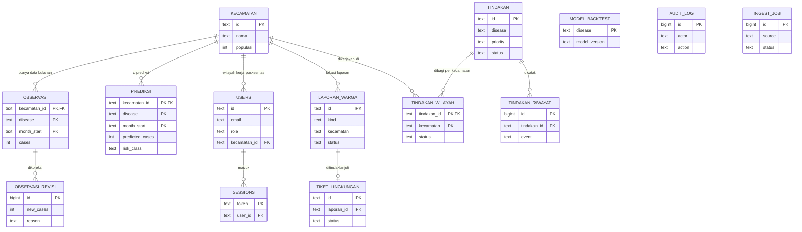

# ERD PRAKIRA

Gambaran umum basis data. Hanya kunci dan kolom utama yang ditampilkan; skema lengkap ada di
`backend/src/db/schema.sql`.

Catatan:

- `MODEL_BACKTEST`, `AUDIT_LOG`, dan `INGEST_JOB` berdiri sendiri, tanpa relasi ke tabel lain.
- Relasi `KECAMATAN` ke `LAPORAN_WARGA` dan `TINDAKAN_WILAYAH`, serta `OBSERVASI` ke
  `OBSERVASI_REVISI`, bersifat logis (dicocokkan lewat nama/kunci) dan tidak dijaga foreign key di
  basis data.
