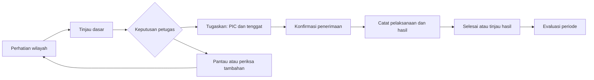

# Audit UX dan alur bisnis PRAKIRA

Tanggal: 22 September 2026. Acuan repositori: `16ea357` dan berkas kerja saat audit.

Arah produk: **operasional Dinkes dan puskesmas menjadi alur utama; demo mengikuti alur operasional yang sama. Tidak menambah dashboard DLH. Untuk masalah yang menjadi kewenangan DLH, lingkup kerja Dinkes di PRAKIRA berakhir pada penyampaian laporan yang tercatat; pengelolaan dan penyelesaian pekerjaan DLH berada di luar lingkup produk ini.**

## 1. Kesimpulan dan keputusan yang disarankan

PRAKIRA memiliki proposisi nilai yang jelas: membantu petugas mengetahui wilayah yang perlu diperhatikan lebih awal dan menindaklanjutinya. Namun, pengalaman saat ini lebih kuat dalam menyajikan informasi daripada membawa pekerjaan sampai selesai. Pengguna masih harus menghubungkan sendiri risiko, prioritas, instruksi, pelaksanaan, dan hasil.

Sumber kerumitannya ada di empat lapisan:

1. **Prioritas produk:** fitur operasional, analisis, transparansi, komunikasi publik, dan peragaan mendapat tempat yang saling bersaing.
2. **Alur bisnis:** arti penugasan, penerimaan tugas, penyelesaian, kewenangan publikasi, dan kepemilikan rekap wilayah belum tercermin secara utuh dalam pengalaman pengguna.
3. **Arsitektur informasi:** informasi yang dibutuhkan untuk satu keputusan tersebar, sedangkan beberapa pekerjaan berbeda ditumpuk pada satu halaman.
4. **UI dan bahasa:** panel padat, huruf pendukung kecil, pendahuluan panjang, serta istilah pemodelan menghabiskan perhatian sebelum pengguna sampai ke pekerjaannya.

Rekomendasi utamanya adalah mengubah pusat pengalaman menjadi **prioritas → keputusan → penugasan → hasil** untuk pekerjaan kesehatan yang menjadi tanggung jawab Dinkes/puskesmas. Laporan di luar kewenangan tersebut mengikuti alur singkat **periksa kelengkapan → sampaikan ke instansi terkait → arsip penerusan**. Peta, tren, model, dan dokumen menjadi pendukung pada langkah yang membutuhkannya. Penyederhanaan harus mengurangi keputusan yang tidak perlu, sambil mempertahankan bukti dan ketidakpastian yang penting.

Urutan perubahan: bereskan klaim layanan yang menyesatkan; lengkapi akhir alur tindakan; rapikan pintu masuk dan konteks; kemudian sederhanakan tampilan serta evaluasi lanjutannya.

## 2. Cakupan, metode, dan batas bukti

Audit mencakup **22 berkas rute halaman**, termasuk satu pengalihan rute dan satu halaman pengembangan, beserta komponen alur utamanya. Istilah halaman/rute di dokumen ini merujuk pada tempat yang digunakan pengguna. Endpoint dibaca seperlunya untuk memastikan arti tindakan dan perubahan data; audit ini tidak menilai kualitas kode, keamanan, performa, atau akurasi statistik model.

Metode:

- Inventaris tujuan, pembaca, tindakan utama, hasil akhir, serta hubungan antarhalaman dari antarmuka dan definisi perilaku aplikasi.
- Penelusuran alur warga, Dinkes, puskesmas, analis, administrator, dan koordinasi lingkungan.
- Inspeksi browser lokal pada beranda, formulir laporan, masuk, dan buletin. Formulir juga dilihat pada ukuran 390 × 844.
- Pemeriksaan sumber perilaku konsol, status, dokumen, impor data, dan pelacakan.
- Pembandingan dengan prinsip pengungkapan informasi bertahap dan pola konfirmasi layanan publik.

**Batas bukti:** frontend lokal berjalan, tetapi layanan data lokal tidak aktif. Keadaan berisi data dan sesi Dinkes/puskesmas belum diuji langsung di browser. Temuan konsol didasarkan pada susunan halaman dan perilaku yang tertulis di aplikasi. Kegagalan data di browser adalah kondisi audit lokal, bukan bukti bahwa layanan produksi sedang gagal. Tidak ada transaksi laporan, perubahan status, impor, pelatihan model, atau pengiriman pesan yang dilakukan.

Ini adalah audit ahli, bukan hasil wawancara atau uji kegunaan dengan petugas. Dampak seperti kebingungan, salah tafsir, dan pengabaian antrean adalah risiko yang beralasan dari bukti desain; besarnya perlu diukur dengan pengguna. Angka target pada bagian validasi merupakan usulan, bukan hasil pengukuran.

## 3. Tujuan bisnis dan pekerjaan tiap pihak

**Janji produk yang disarankan:** “Membantu Dinkes menentukan wilayah yang perlu ditindaklanjuti, mengoordinasikan pelaksanaannya, dan melihat hasilnya berdasarkan prakiraan serta laporan lapangan.”

Nilai operasionalnya dinilai dari keputusan yang lebih cepat, penanggung jawab yang jelas, data yang layak digunakan, serta tindak lanjut yang dapat ditelusuri. Jumlah grafik, banyaknya laporan masuk, dan banyaknya surat dicetak belum membuktikan nilai tersebut.

| Pihak | Pekerjaan utama | Hasil yang dibutuhkan | Tampilan awal yang disarankan |
|---|---|---|---|
| Koordinator Dinkes | Menentukan prioritas dan mengalokasikan tindak lanjut | Keputusan, unit/PIC, tenggat, alasan | Prioritas yang perlu diputuskan dan pekerjaan yang tersendat |
| Petugas puskesmas | Memeriksa laporan, melaksanakan tugas, menyerahkan rekap | Tugas wilayah selesai, hasil tercatat, rekap benar | Tugas dan laporan dalam cakupan kerjanya |
| Pimpinan Dinkes | Menilai kesiapan dan pelaksanaan | Ringkasan masalah yang belum tertangani dan hasil periode | Ringkasan pada ruang kerja yang sama, tanpa dashboard baru |
| Analis | Menilai bukti, kualitas prakiraan, dan skenario | Rekomendasi beserta batas penggunaannya | Evaluasi dan akses ke detail wilayah |
| Administrator/pengelola data | Memastikan data dan proses pembaruan siap | Periode lengkap, kegagalan tertangani, versi tercatat | Kesiapan data dan pengelolaan sistem |
| Warga | Memahami risiko wilayah, melapor, dan mengetahui tindak lanjut | Arahan yang jelas dan laporan yang dapat dilacak | Cek wilayah, lapor, lacak |
| Petugas Dinkes yang meneruskan laporan | Menyampaikan informasi yang menjadi kewenangan instansi lain | Tujuan, waktu, kanal, dan referensi penerusan | Aksi Teruskan pada detail laporan dan riwayat penerusan |

Pembagian ini adalah rancangan tanggung jawab, bukan klaim bahwa susunan organisasi atau SOP Dinkes sudah disepakati. Peran, wilayah kerja, pemilik konsolidasi data, serta siapa yang berhak menyetujui tindakan harus divalidasi dengan calon operator.

## 4. Inventaris seluruh halaman dan keputusan produk

| Halaman saat ini | Tujuan yang semestinya | Temuan UX/bisnis | Nasib yang disarankan |
|---|---|---|---|
| `/` | Warga mengecek wilayah dan mengetahui langkah berikutnya | Pencarian wilayah sudah jelas; ringkasan kota, cara kerja, ranking, edukasi, akurasi, dan ajakan pelaporan membuat halaman panjang | Pertahankan sebagai pintu publik tunggal. Hasil wilayah dan langkah berikutnya didahulukan; penjelasan produk menjadi sekunder |
| `/warga` | Memilih kirim atau lacak laporan | Dua tindakan jelas, tetapi narasi pemodelan tidak menjawab kebutuhan layanan warga | Pertahankan sebagai pusat laporan; tautan berlabel “Kirim laporan” boleh langsung menuju formulir |
| `/warga/lapor` | Mengirim temuan yang dapat diperiksa | Enam bidang masuk akal; pengantar besar dan istilah evaluasi model menambah beban; janji penerusan lingkungan tidak konsisten | Pertahankan, ringkas pengantar, tampilkan pertanyaan sesuai jenis laporan |
| `/warga/status` | Memahami keputusan dan tindak lanjut | Kode lacak dan urutan pemeriksaan sudah ada; verifikasi dan penyelesaian perlu lebih tegas dibedakan | Pertahankan sebagai bukti layanan, dengan tindakan berikutnya yang jelas |
| `/masuk` | Masuk dan kembali ke pekerjaan | Pemulihan kata sandi mengarah ke halaman kontak yang belum mengirim pesan | Pertahankan; sediakan jalur bantuan akun yang benar-benar dikelola |
| `/dashboard` | Menentukan perhatian dan keputusan pertama | Angka, peta, panel detail, serta ranking mendahului hubungan ke tindakan; fokus awal hanya satu penyakit | Ubah menjadi Beranda/Prioritas; peta menjadi tampilan pendukung yang tetap mudah dibuka |
| `/tindakan` | Menugaskan, memantau, dan menyelesaikan tindak lanjut | Antrean sudah terurut dan punya status, tetapi alur UI berhenti pada penandaan berjalan | Jadikan ruang kerja Tindakan dengan hasil dan penutupan yang jelas |
| `/verifikasi` | Memeriksa laporan dan menentukan tindak lanjut sesuai kewenangan | Ringkasan, pengelolaan tiket lingkungan, eskalasi, dan kendali demo mendahului antrean | Jadikan Laporan warga; pertahankan pemeriksaan dan tindak lanjut kesehatan. Ganti pengelolaan pekerjaan DLH dengan aksi Teruskan dan arsip penerusan |
| `/kasus` | Menyerahkan rekap resmi yang benar | Sudah ada entri dan impor; kepemilikan angka wilayah, koreksi, serta kesiapan periode kurang jelas | Masuk area Data; utamakan status rekap wilayah/periode |
| `/analitik` | Mengevaluasi situasi dan hasil periode | Korelasi iklim dan rekap tersedia, tetapi hubungan dengan hasil intervensi belum menjadi pusat | Masuk Data & evaluasi; tren dan korelasi di tampilan analisis lanjutan |
| `/admin` | Mengelola kesiapan data dan model | Fokus pada ingest, hitung ulang, pelatihan, dan audit; kebutuhan operator adalah mengetahui data mana yang belum siap | Khusus pengelola, terpisah dari pekerjaan klinis rutin |
| `/admin/prioritas` | Membantu keputusan alokasi Dinkes | Peringkat mempertimbangkan populasi/kepadatan, tetapi akses navigasinya ditonjolkan untuk administrator | Gabungkan fungsi prioritas ke Beranda Dinkes; pembobotan menjadi pilihan analisis |
| `/prioritas` | Membuka prioritas | Hanya pengalihan ke halaman prioritas admin | Pertahankan sebagai kompatibilitas tautan; tidak perlu menu tersendiri |
| `/model` | Menjelaskan kelayakan dan batas prakiraan | Banyak bagian evaluasi berguna bagi analis, terlalu dalam sebagai kebutuhan awal warga | Tetap tersedia publik; ringkasan mudah dipahami di depan, metrik lengkap di detail |
| `/mesin-waktu` | Memeriksa prakiraan pada kejadian historis | Nilai pembuktian dan demo tinggi; bukan langkah rutin untuk menugaskan petugas | Tempatkan di Evaluasi historis; “Mesin waktu” boleh menjadi nama demo sekunder |
| `/simulasi` | Membandingkan skenario cuaca | Berguna untuk perencanaan, tetapi berpotensi disamakan dengan prakiraan aktif | Jadikan analisis lanjutan dengan penanda Skenario; tidak langsung menerbitkan instruksi |
| `/buletin` | Menyusun ringkasan periode untuk ditinjau | Klaim resmi, tanda tangan, dan keluaran saat data gagal berisiko menyesatkan | Jadikan Draf buletin; hanya ekspor ketika sumber dan status dokumen jelas |
| `/tindakan/nota/[id]` | Menyiapkan surat dari tindakan yang dipilih | Label draf sudah tepat; istilah “ditandai terkirim” masih lebih kuat daripada kejadian yang dicatat | Pertahankan dari detail tindakan; samakan bahasa status |
| `/sistem` | Informasi layanan publik dan situasi wilayah | Menjadi pintu publik kedua; rekomendasi tindakan internal ditampilkan sebagai informasi pelaksanaan publik | Konsolidasikan ke pintu publik utama; pertahankan tautan lama menuju tujuan yang relevan |
| `/tentang` | Memahami pengelola, tujuan, cakupan, dan batas layanan | Fondasi teknologi mengambil porsi besar; beberapa klaim perlu diselaraskan dengan layanan aktual | Ringkas untuk masyarakat; metodologi rinci menuju Model/Evaluasi |
| `/hubungi-kami` | Menghubungi pengelola layanan yang nyata | Tampilan sukses dan janji waktu respons tanpa proses pengiriman | Perbaiki sebelum digunakan sebagai kanal bantuan; bedakan bantuan aplikasi dari laporan lapangan |
| `/dev` | Pemeriksaan komponen oleh tim pengembangan | Bukan pekerjaan pengguna produk | Tetap alat internal, tanpa peran dalam alur operasional/demo pengguna |

Fitur di dalam halaman juga masuk audit: pemilih penyakit/wilayah, peta dan lapisan laporan, panel alasan prediksi, ranking, filter antrean, checklist SOP, instruksi massal, draf pesan, kit siaran/QR, nota, buletin, eskalasi, kendali lonjakan demo, arahan mandiri, tiket lingkungan, entri manual, impor CSV, pemutakhiran data, pelatihan/evaluasi sinyal warga, audit aktivitas, metrik model, cakupan, uji historis, simulator, kalkulator asumsi dampak, aksesibilitas, dan pelacakan kode.

## 5. Temuan utama berdasarkan dampak

P0: bereskan sebelum dipresentasikan atau digunakan sebagai layanan yang dapat dipercaya. P1: inti penyederhanaan dan kelengkapan alur. P2: perbaikan pendukung. Tingkat prioritas ini merupakan penilaian audit, bukan hasil pengukuran insiden.

### F01 — Buletin menyatakan otorisasi yang tidak dibuktikan alur (P0)

Browser menampilkan “RESMI” dan “DITANDATANGANI ELEKTRONIK”, beserta identitas penanda tangan. Sumber halaman langsung merender elemen tersebut; tidak ada langkah pengesahan dalam alur yang diperiksa. Berbeda dengan nota yang sudah menyebut dirinya draf.

**Dampak:** pengguna dapat menganggap keluaran cetak sebagai keputusan dinas yang sudah disahkan. **Solusi:** gunakan “Draf buletin PRAKIRA”; kosongkan identitas pengesahan sampai diisi melalui proses yang berwenang; bedakan disusun, ditinjau, dan disahkan. Dokumen menyebut periode data, waktu penyusunan, sumber, dan batas penggunaan. Proses persetujuan aktual perlu disepakati pengelola layanan. [Bukti buletin](D:/prakira/frontend/src/app/buletin/page.tsx:524), [pembanding nota](D:/prakira/frontend/src/components/official-memo.tsx:144).

### F02 — Gagal memuat data dapat terbaca sebagai nol kasus (P0)

Pada kondisi layanan data lokal tidak aktif, beranda menampilkan 0 siaga/waspada/rendah bersama pesan gagal. Buletin menampilkan prakiraan 0, rentang 0–0, periode kosong, serta tombol cetak. Tanggal penerbitannya bahkan menampilkan tanggal bawaan saat audit.

**Dampak:** tidak adanya data dapat disalahartikan sebagai tidak adanya risiko. **Solusi:** bedakan “belum dimuat”, “tidak tersedia”, “data historis”, dan nilai nol yang benar. Hilangkan narasi hasil dan keluaran final saat data belum layak. Tampilkan sebab yang dapat dipahami serta langkah pemulihan. [Bukti ringkasan kota](D:/prakira/frontend/src/components/landing/city-pulse.tsx:60), [bukti buletin](D:/prakira/frontend/src/app/buletin/page.tsx:81).

### F03 — Kanal bantuan menjanjikan pengiriman yang tidak terjadi (P0)

Formulir kontak hanya mengubah keadaan tampilan menjadi sukses, tetapi menyatakan pesan berhasil terkirim dan menjanjikan respons 1×24 jam kerja. Tautan “Lupa kata sandi?” mengarah ke halaman ini.

**Dampak:** pengguna berhenti mencari bantuan karena merasa sudah menghubungi petugas; pemulihan akses berakhir buntu. **Solusi:** gunakan kanal bantuan yang dikelola pemilik layanan, atau sembunyikan pengiriman sampai operasionalnya tersedia. Klaim diterima dan estimasi respons hanya muncul setelah ada penerimaan nyata dan komitmen layanan. [Bukti kontak](D:/prakira/frontend/src/app/hubungi-kami/page.tsx:12), [bukti pemulihan akun](D:/prakira/frontend/src/components/auth/sign-in-form.tsx:73).

### F04 — Alur tindakan belum membawa pengguna sampai selesai (P1, penghalang pemakaian operasional)

Status Selesai dan tampilan arsip sudah tersedia. Namun, penelusuran antarmuka hanya menemukan penulisan status menjadi berjalan. Tindakan yang sudah berjalan membuka protokol; tombol utama dinonaktifkan menjadi “Sudah diinstruksikan”. Tidak ditemukan jalur UI untuk melaporkan hasil dan menyelesaikan tindakan.

**Dampak:** produk mencatat awal pekerjaan tanpa memastikan hasilnya. **Solusi:** detail tindakan harus memuat PIC/unit, tenggat, penerimaan tugas, kendala, catatan pelaksanaan, dan penyelesaian. Koordinator dapat meninjau hasil bila diperlukan SOP. [Bukti perubahan status](D:/prakira/frontend/src/components/early-action-center.tsx:128), [bukti akhir dialog](D:/prakira/frontend/src/components/dispatch-action-modal.tsx:470).

### F05 — Penandaan status, komunikasi, dan bukti kerja bercampur (P1)

Aplikasi sudah menjelaskan bahwa draf pesan perlu dikirim manual. Namun, status yang sama disebut “berjalan”, “sudah diinstruksikan”, dan pada nota “ditandai terkirim”. Centang SOP di dialog hanya dipakai dalam interaksi/toast, tidak disimpan bersama hasil tindakan melalui pemanggilan perubahan status tersebut.

**Dampak:** orang yang membaca belakangan tidak tahu apakah pesan benar-benar disampaikan, diterima, atau kegiatan dilaksanakan. **Solusi:** bedakan kejadian itu dalam catatan; label tombol menyebut kejadian yang benar-benar dicatat. Checklist panduan jangan menyerupai bukti penyelesaian jika tidak disimpan. Tindakan massal dibatasi pada daftar yang sengaja dipilih dan sudah ditinjau. [Bukti checklist](D:/prakira/frontend/src/components/dispatch-action-modal.tsx:94), [bukti instruksi massal](D:/prakira/frontend/src/components/early-action-center.tsx:139).

### F06 — Dashboard meminta pembaca menganalisis sebelum tahu pekerjaannya (P1)

Urutan halaman adalah pemilih penyakit, tiga ringkasan angka, peta besar, panel kecamatan, tautan tindakan tertunda, lalu ranking. Panel kecamatan menggabungkan skor, kasus, insidensi, prakiraan/rentang, cuaca, persentil, sinyal warga, dan tren kota. Konteks kota di panel wilayah sudah diberi label, tetapi tetap menuntut perpindahan cara membaca.

**Dampak:** petugas memahami situasi tanpa segera tahu apa yang harus diputuskan. **Solusi:** buka dengan daftar perhatian lintas penyakit yang memiliki alasan dan tindakan berikutnya. Peta dan tren dibuka untuk membandingkan atau memeriksa dasar keputusan. [Bukti urutan dashboard](D:/prakira/frontend/src/app/dashboard/page.tsx:318), [bukti panel](D:/prakira/frontend/src/components/district-detail-panel.tsx:201).

### F07 — Terdapat beberapa makna prioritas tanpa pintu keputusan yang sama (P1)

Dashboard memiliki ranking risiko; halaman prioritas memiliki pembobotan populasi/kepadatan; antrean tindakan memakai status dan tenggat. Masing-masing berguna untuk pertanyaan berbeda. Akan tetapi, menu Prioritas Terdampak muncul pada cabang administrator, sedangkan Dinas diizinkan membuka halamannya tanpa menu setara.

**Dampak:** petugas sulit mengetahui daftar mana yang harus diikuti untuk alokasi. **Solusi:** satukan pintu keputusan Dinkes. Jelaskan dasar urutan: perhatian lapangan, tenggat, kesiapan data, dan pertimbangan risiko. Analisis populasi menjadi bukti tambahan; pemilihan bobot tidak diam-diam menjadi kebijakan operasional. Jangan menjumlahkan skor lintas penyakit atau menyamakan persentil dengan peluang seseorang sakit. [Bukti navigasi](D:/prakira/frontend/src/components/sidebar.tsx:127), [bukti akses prioritas](D:/prakira/frontend/src/components/admin-priority-view.tsx:23).

### F08 — Halaman Verifikasi menempatkan pekerjaan inti setelah pekerjaan lain (P1)

Empat ringkasan diikuti antrean tiket lingkungan, eskalasi, dan kendali demo untuk Dinas; filter serta daftar laporan baru muncul sesudahnya. Daftar tiket dapat terus memanjang.

**Dampak:** pekerjaan verifikasi terdorong ke bawah dan Dinkes dibebani kendali pelaksanaan pekerjaan instansi lain. **Solusi:** tampilkan antrean Perlu diperiksa sebagai keadaan awal. Pengelolaan tiket DLH diganti dengan aksi Teruskan pada detail laporan dan arsip penerusan. Kendali PIC, Mulai tangani, dan Tandai selesai untuk pekerjaan DLH dihapus dari rancangan ruang kerja Dinkes. Eskalasi menjadi penanda yang membuka antrean wilayah terkait. Kendali demo dipindahkan ke mode peragaan yang eksplisit. [Bukti susunan](D:/prakira/frontend/src/components/verification-queue.tsx:615), [bukti kendali tiket](D:/prakira/frontend/src/components/environment-ticket-queue.tsx), [bukti demo](D:/prakira/frontend/src/components/escalation-panel.tsx:321).

### F09 — Dinkes dan puskesmas belum memiliki fokus kerja yang cukup berbeda (P1)

Navigasi utama membedakan administrator dari peran lainnya. Dinkes, analis, dan puskesmas mengikuti cabang menu yang sama; verifikasi berawal pada semua kecamatan. Entri manual memilih kecamatan pertama yang tersedia sebagai awal.

**Dampak:** operator harus terus menyaring ruang kerjanya sendiri; salah wilayah lebih mudah terjadi. **Solusi:** petugas membuka tugas dan wilayah yang ditetapkan baginya, dengan cakupan terlihat jelas. Koordinator membuka lintas wilayah. Analis mendapat pintu evaluasi. Ini persoalan pembagian pekerjaan dan konteks; pengujian hak akses teknis berada di luar audit ini. [Bukti sidebar](D:/prakira/frontend/src/components/sidebar.tsx:141), [bukti filter](D:/prakira/frontend/src/components/verification-queue.tsx:541), [bukti entri](D:/prakira/frontend/src/components/manual-case-entry.tsx:100).

### F10 — Janji penerusan laporan lingkungan tidak konsisten (P1)

Formulir mengatakan laporan lingkungan diteruskan ke DLH; tanda terima juga memakai tujuan keluarga laporan. Pada verifikasi, petugas sebenarnya memilih arahan mandiri atau tiket DLH. Membuat tiket dan meneruskan melalui kanal kerja yang diterima instansi merupakan dua kejadian berbeda.

**Dampak:** warga mengharapkan penanganan instansi sebelum keputusan atau penerusan benar-benar terjadi; Dinkes terlihat bertanggung jawab atas pelaksanaan DLH. **Solusi:** sebelum keputusan, tulis “Petugas memeriksa laporan dan menentukan tindak lanjut”. Untuk penerusan, tampilkan “Perlu diteruskan” lalu “Diteruskan ke DLH” setelah penyampaian tercatat. Tampilkan tanggal dan referensi bila tersedia, serta penjelasan bahwa penanganan mengikuti layanan instansi penerima. Jangan menjanjikan pelacakan pengerjaan DLH melalui PRAKIRA tanpa sumber pembaruan dari instansi tersebut. [Bukti keluarga tujuan](D:/prakira/frontend/src/lib/reports.ts:90), [bukti pilihan petugas](D:/prakira/frontend/src/components/verification-queue.tsx:337).

### F11 — Informasi laporan belum selalu cukup untuk pekerjaan lapangan (P1)

Kecamatan wajib, sedangkan kelurahan/RT/RW opsional dan lokasi rinci bergantung pada narasi. Verifikasi menyediakan Terima/Tolak; lokasi yang tidak dapat ditelusuri menjadi contoh alasan penolakan. Tidak ada alur perbaikan laporan yang utuh dalam UI yang diperiksa.

**Dampak:** operator tidak bisa menemukan lokasi atau meminta penjelasan; warga perlu mengulang dari awal. **Solusi:** gunakan pertanyaan lokasi yang proporsional dengan jenis temuan, seperti patokan atau titik pilihan pengguna, tanpa memaksa izin GPS. Pertahankan pelaporan tanpa akun. Pertimbangkan “Perlu informasi” melalui kode lacak dan revisi terkait laporan yang sama. Jika belum dibuat, jelaskan bahwa data belum cukup dan tautkan pengiriman ulang yang terhubung. Gabungkan duplikat pada kejadian yang sama tanpa menghapus jejak pelapor. [Bukti kelengkapan minimal](D:/prakira/frontend/src/components/citizen-report-form.tsx:217), [bukti keputusan](D:/prakira/frontend/src/components/verification-queue.tsx:296).

### F12 — Bahasa warga menjelaskan proses model sebelum manfaat layanan (P1)

Kalimat tentang agregasi bulanan dan evaluasi model muncul pada pengantar portal/formulir. Pada layar 390 × 844, pengantar dan ruang kosong mendorong pilihan pertama mendekati bagian bawah layar. Hasil risiko rendah juga diberi label “Aman”.

**Dampak:** pengiriman terasa panjang dan istilah risiko mudah ditafsirkan sebagai jaminan keselamatan. **Solusi:** pengantar singkat menjawab apa yang boleh dilaporkan, siapa yang memeriksa, dan bagaimana melacak. Gunakan “Risiko rendah” dengan periode jelas; uraian pemanfaatan data tersedia pada penjelasan sekunder. Rekomendasi ini terkait pemahaman label, bukan validasi medis atas materi edukasi. [Bukti pengantar](D:/prakira/frontend/src/app/warga/lapor/page.tsx:20), [bukti label risiko](D:/prakira/frontend/src/components/landing/risk-result-section.tsx:39).

### F13 — Rekap kasus belum menegaskan kepemilikan angka dan akibat koreksi (P1)

Entri manual menyimpan satu angka untuk kombinasi kecamatan, penyakit, dan bulan; pengisian ulang mengganti angka sebelumnya. UI menekankan “mencatat kasus” dan keberhasilan penyimpanan. Jika beberapa faskes menyumbang data wilayah yang sama, aturan konsolidasinya perlu dipastikan.

**Dampak:** operator dapat mengira sedang menambah kontribusi faskes, padahal mengganti total wilayah. **Solusi awal yang sesuai bentuk data sekarang:** sebut “Total rekap kecamatan”, tetapkan pemilik rekap, tampilkan nilai lama → baru serta alasan koreksi. Bila kebutuhan sebenarnya adalah kontribusi setiap faskes, rancang proses konsolidasi tersendiri sebelum membuka input itu. Tampilkan kelengkapan periode dan kesiapan publikasi, bukan hanya jumlah baris berhasil. [Bukti UI entri](D:/prakira/frontend/src/components/manual-case-entry.tsx:140), [bukti arti penyimpanan](D:/prakira/backend/src/routes/cases.ts:122).

### F14 — Jalur publik dan alat analisis bersaing dengan layanan utama (P2)

Beranda dan `/sistem` menyajikan pintu publik paralel. Konsol mengarahkan analisis/model ke tampilan publik dengan navigasi berbeda. Simulator, uji historis, metrik, dan kalkulator dampak memiliki kegunaan berbeda, tetapi hubungan ke keputusan sehari-hari belum cukup kuat.

**Dampak:** eksplorasi terasa seperti berpindah produk dan pengguna harus mencari jalan kembali. **Solusi:** satu pintu publik; analisis lanjutan berada dalam konteks evaluasi petugas, sambil tetap menyediakan tautan transparansi publik. Kembali ke pekerjaan mempertahankan penyakit, wilayah, periode, serta pilihan antrean. [Bukti halaman paralel](D:/prakira/frontend/src/app/sistem/page.tsx), [bukti tautan lintas tampilan](D:/prakira/frontend/src/components/sidebar.tsx:220).

### F15 — Publikasi informasi belum terpisah jelas dari rekomendasi internal (P1)

Halaman layanan publik membaca rekomendasi tindakan dan menerjemahkan statusnya menjadi “Menunggu pelaksanaan” atau “Sedang dilaksanakan”. Alur yang diperiksa belum memiliki keputusan penerbitan informasi publik tersendiri.

**Dampak:** warga dapat membaca usulan sistem sebagai kegiatan yang telah disetujui dinas. **Solusi:** publik hanya melihat arahan atau kegiatan yang ditinjau untuk publikasi. Rekomendasi internal tetap dapat dibaca petugas sebagai usulan sampai disetujui. [Bukti tampilan publik](D:/prakira/frontend/src/components/sistem/active-alerts.tsx:51).

### F16 — Sebagian label mengklaim hasil lebih jauh dari catatannya (P1)

Ringkasan instruksi massal memakai “Warga terlindungi” untuk populasi sasaran. Tindakan selesai memperoleh label “Tenggat terpenuhi” tanpa membedakan waktu penyelesaian. Kalkulator dampak sudah meminta asumsi/sumber, tetapi berada dekat alat prioritas sehingga mudah dibaca sebagai hasil nyata.

**Dampak:** laporan kinerja dapat melebihkan capaian. **Solusi:** gunakan “Penduduk di wilayah sasaran”, hitung ketepatan waktu dari tanggal sebenarnya, dan pisahkan estimasi skenario dari hasil terukur. Jangan mengklaim kasus berhasil dicegah hanya karena tindakan selesai. [Bukti populasi](D:/prakira/frontend/src/components/early-action-center.tsx:324), [bukti tenggat](D:/prakira/frontend/src/components/action-queue.tsx:127), [bukti kalkulator](D:/prakira/frontend/src/components/impact-calculator.tsx).

### F17 — Kepadatan visual dan bahasa memperbesar biaya membaca (P2)

Panel operasional memakai beberapa tingkat tulisan sangat kecil, banyak kartu di dalam kartu, ikon, serta warna risiko pada banyak elemen sekaligus. Grafik tren kota ditempatkan dalam detail kecamatan. Ini terkonfirmasi dari struktur/gaya sumber; keterbacaan konsol pada perangkat petugas belum diuji langsung.

**Solusi:** satu tingkat judul yang konsisten, teks penjelas yang terbaca, tabel/list untuk perbandingan, serta satu tombol utama per keadaan pekerjaan. Pisahkan risiko wilayah dari status pekerjaan dan status data. Detail teknis cukup dibuka saat diperlukan. Preferensi aksesibilitas yang sudah ada tetap dipertahankan, lalu diuji dengan keyboard dan pembesaran bersama pengguna.

### F18 — Setelah data masuk, operator belum mendapat jawaban kesiapan layanan (P1)

Pesan sukses entri/impor menekankan data siap dipelajari saat pelatihan berikutnya. Pengelolaan menyediakan hitung ulang dan pelatihan; peringatan keterlambatan data sudah ada. Namun, operator perlu satu jawaban: periode apa yang lengkap, prakiraan apa yang sah dibaca, dan siapa yang harus mengerjakan kekurangan.

**Solusi:** tampilkan perjalanan “rekap tersimpan → diperiksa → periode siap → prakiraan diperbarui → ditinjau untuk penggunaan”. Nama tahap mengikuti SOP yang disepakati. Pelatihan model merupakan pekerjaan khusus; petugas pencatat cukup tahu status rekap dan pihak berikutnya. Perbandingan model bersinyal warga tetap dinyatakan sebagai evaluasi sampai benar-benar dipakai. [Bukti impor](D:/prakira/frontend/src/components/case-csv-import.tsx), [bukti peringatan periode](D:/prakira/frontend/src/components/data-lag-notice.tsx), [bukti evaluasi model](D:/prakira/frontend/src/components/admin-model-retrain.tsx:329).

## 6. Susunan produk yang disarankan

Empat area kerja Dinkes berikut adalah kelompok tujuan, bukan empat halaman panjang yang menampung seluruh komponen lama.

| Area | Pertanyaan pengguna | Isi awal | Isi yang dibuka bila perlu |
|---|---|---|---|
| **Beranda / Prioritas** | Apa yang perlu saya putuskan lebih dulu? | Daftar perhatian, alasan singkat, tindak lanjut terbuka, periode/cakupan data | Peta, perbandingan wilayah, tren, dasar prakiraan, pertimbangan populasi |
| **Tindakan** | Siapa mengerjakan tugas kesehatan, dan apa hasilnya? | Perlu penugasan, sedang ditangani, terkendala/lewat tenggat dalam lingkup Dinkes/puskesmas | Detail tugas, riwayat, SOP, hasil, dokumen dan draf komunikasi |
| **Laporan warga** | Laporan mana yang perlu diperiksa, ditindaklanjuti, atau diteruskan? | Antrean pemeriksaan dengan wilayah dan umur laporan | Arahan, aksi penerusan, arsip penerusan, laporan terkait, hasil tindak lanjut kesehatan |
| **Data & evaluasi** | Apakah datanya siap dan keputusan kita bekerja? | Kesiapan rekap, periode aktif, ringkasan pelaksanaan | Entri/impor, tren historis, evaluasi model, uji historis, simulasi, kalkulator asumsi |

Empat area merupakan hipotesis awal yang perlu diuji. Jika petugas rutin menggunakan entri data, pintasan “Isi rekap” langsung ditampilkan di ruang kerja puskesmas. Mengurangi jumlah menu tidak boleh menambah langkah pekerjaan yang paling sering dilakukan.

Peran lain menggunakan susunan yang sama dengan pintu awal sesuai tugas. Puskesmas melihat “Tugas saya”, “Laporan wilayah”, dan “Rekap kasus”. Administrator memiliki “Kesiapan data”, “Pengelolaan model”, dan “Riwayat perubahan”. Alat administrator tidak menjadi langkah wajib petugas untuk melaksanakan tindakan.

Ruang publik memiliki tiga tindakan yang mudah ditemukan: **Cek risiko wilayah, Kirim laporan, Lacak laporan**. “Tentang”, “Metode dan batasan”, serta “Bantuan” menjadi informasi pendukung. Tautan yang bertuliskan Kirim laporan langsung menuju formulir; pengguna tidak perlu melewati portal pilihan sekali lagi.

Konteks yang harus bertahan sepanjang pekerjaan: wilayah, penyakit, periode, peran/cakupan kerja, dan item yang sedang diperiksa. Tautan dari satu wilayah menuju tindakan membuka tindakan wilayah tersebut, dengan opsi jelas untuk memperluas cakupan.

## 7. Alur yang diusulkan sampai hasil akhir

### A. Dinkes: dari perhatian menjadi pekerjaan yang selesai

Alur penugasan sampai hasil pada bagian ini berlaku untuk pekerjaan kesehatan dalam kewenangan Dinkes/puskesmas. Penerusan ke DLH mengikuti bagian E dan tidak masuk antrean pelaksanaan kesehatan.

1. Petugas membuka Beranda dan melihat perhatian lintas penyakit beserta periode data. Kejadian lapangan terkini dan prakiraan bulanan memiliki label sumber/waktu berbeda.
2. Petugas memilih satu perhatian. Ringkasan menjawab: wilayah, masalah, alasan, ketidakpastian, tindakan yang sudah ada, dan keputusan berikutnya.
3. Petugas memeriksa dasar bila perlu. Perbandingan wilayah mempertahankan konteks agar tidak bolak-balik mencari data.
4. Petugas memilih tindak lanjut: tugaskan, pantau, minta pemeriksaan tambahan, atau tunda dengan alasan dan tanggal tinjau ulang. Rekomendasi tidak otomatis menjadi instruksi.
5. Penugasan menyebut unit/PIC, keluaran yang diharapkan, tenggat, dan cara koordinasi. Tugas yang sudah ada ditampilkan untuk mencegah penugasan ganda.
6. Pelaksana mengakui penerimaan atau koordinator mencatat konfirmasi dari kanal kerja yang dipakai. Aplikasi menyebut sumber konfirmasi tersebut.
7. Pelaksana mencatat perkembangan/kendala, kemudian hasil. Bukti harus proporsional dengan jenis tugas; foto tidak menjadi persyaratan universal.
8. Tugas diselesaikan, atau ditinjau koordinator lebih dahulu bila dibutuhkan. Riwayat tetap menunjukkan siapa melakukan apa dan kapan.

**Model status minimal:** Perlu keputusan → Ditugaskan → Dikerjakan → Selesai. “Belum dikonfirmasi”, “Terkendala”, dan “Lewat tenggat” menjadi penanda yang dapat ditindaklanjuti. Pilihan ditunda/dibatalkan memerlukan alasan. “Menunggu peninjauan hasil” ditambahkan hanya bila ada orang dan SOP yang benar-benar mengerjakannya. Penyederhanaan tidak berarti menambah banyak status tanpa pemilik.

### B. Puskesmas: dari tugas wilayah menjadi hasil

Pintu awal adalah pekerjaan yang ditugaskan dan laporan yang menjadi tanggung jawabnya. Petugas membuka tugas, melihat alasan singkat serta SOP yang berlaku, mengonfirmasi atau mencatat kendala, lalu mengisi hasil. Ringkasan kota tersedia sebagai konteks sekunder. Di akhir proses, sistem menjelaskan apakah hasil sudah final atau masih menunggu pemeriksaan koordinator.

### C. Warga: dari temuan menjadi jawaban layanan

1. Warga masuk dari Kirim laporan atau hasil risiko wilayah. Kecamatan sebelumnya tetap terbawa.
2. Warga memilih jenis temuan; hanya pertanyaan yang relevan yang ditampilkan. Gejala dan temuan lingkungan tetap dibedakan tanpa meminta warga menentukan penyakit.
3. Warga mengisi lokasi yang dapat ditelusuri, waktu, dan uraian singkat. Foto tetap opsional. Permintaan data pribadi dibatasi pada kebutuhan layanan yang sudah disepakati.
4. Ringkasan pendek sebelum pengiriman memungkinkan koreksi jenis/lokasi. Tidak perlu memecah enam isian menjadi enam layar; uji formulir singkat satu halaman terlebih dahulu.
5. Tanda terima menjelaskan laporan sudah diterima sistem, siapa yang akan memeriksa, apa langkah berikutnya, dan cara menyimpan kode/tautan pelacakan. Tambahkan opsi menyimpan tanda terima; jangan menjanjikan pemulihan kode lewat identitas yang memang tidak dikumpulkan.
6. Pada pelacakan, tampilkan pemeriksaan dan tindak lanjut sesuai kewenangan. “Terverifikasi” berarti temuan dibenarkan, bukan berarti masalah selesai. Untuk laporan ke DLH, keluaran akhir PRAKIRA adalah catatan “Diteruskan ke DLH”, bukan klaim pekerjaan lingkungan selesai.
7. Jika ditolak, perlu informasi, atau terkait laporan lain, warga mendapat alasan dan tindakan yang bisa dilakukan. Hindari memulai ulang tanpa hubungan ke laporan sebelumnya.

Estimasi waktu pemeriksaan dipublikasikan setelah pemilik layanan menyepakati kapasitasnya. Sebelum itu, tampilkan status dan waktu pembaruan terakhir secara jujur. Jangan mengganti ketidakjelasan proses dengan janji 24 jam yang belum memiliki operator.

### D. Petugas: dari laporan masuk menjadi tindak lanjut

Antrean awal hanya menampilkan laporan yang membutuhkan keputusan. Baris ringkas berisi jenis, wilayah, umur laporan, kelengkapan, dan penanda kebutuhan perhatian. Membuka laporan memperlihatkan bukti dan pilihan keputusan. Laporan berulang dapat ditautkan pada kejadian atau tugas yang sama; pelapor tetap mempunyai kode sendiri.

Verifikasi memisahkan tiga pertanyaan: apakah informasi cukup, apa yang dapat diperiksa dalam kewenangan petugas, dan apakah perlu tindak lanjut kesehatan atau penerusan. Dinkes memeriksa kelengkapan/relevansi laporan lingkungan sebelum menyampaikan; penilaian teknis dan pelaksanaan pekerjaan lingkungan menjadi tanggung jawab instansi berwenang. Materi klinis atau intervensi tidak diubah hanya demi memendekkan UI.

### E. Penyampaian laporan ke DLH tanpa pengelolaan pekerjaan DLH

**Batas peran yang disepakati:** Dinkes menyampaikan informasi. Dinkes tidak menetapkan PIC DLH, tenggat pengerjaan DLH, menerima pekerjaan atas nama DLH, mengubah progresnya, atau menyatakan pekerjaannya selesai. Tidak ada dashboard atau akun DLH yang ditambahkan.

Gunakan aksi Teruskan pada detail laporan. Ringkasan penerusan memuat jenis masalah, lokasi, waktu, uraian, serta bukti relevan yang diperlukan instansi penerima. Tujuan instansi untuk setiap jenis masalah mengikuti kewenangan yang disepakati pemilik layanan; semua masalah lingkungan tidak otomatis mempunyai tujuan yang sama.

| Tahap | Yang dikerjakan Dinkes | Yang boleh dikatakan kepada warga |
|---|---|---|
| Perlu diteruskan | Periksa kelengkapan informasi dan pilih instansi tujuan | “Laporan perlu diteruskan ke instansi terkait” |
| Diteruskan | Sampaikan melalui kanal yang digunakan, lalu catat tujuan, waktu, kanal, dan referensi bila tersedia | “Diteruskan ke DLH pada …; penanganan menjadi kewenangan instansi penerima” |

Setelah penyampaian tercatat, laporan keluar dari antrean kerja aktif Dinkes dan masuk arsip Diteruskan. Dinkes tidak dibebani mengejar progres pekerjaan DLH sampai selesai. Jika penyampaian gagal, laporan tetap Perlu diteruskan dengan alasan kegagalan; ini pekerjaan penerusan yang belum selesai, bukan tunggakan penanganan lingkungan.

Selama tidak ada integrasi pengiriman, tombolnya adalah “Siapkan ringkasan” dan “Catat sudah diteruskan”. Menyalin ringkasan atau membuat catatan internal tidak otomatis berarti laporan telah dikirim. Tanda terima tujuan dapat dilampirkan jika tersedia tanpa menambah tahapan wajib pemantauan DLH. Referensi atau kanal pelacakan instansi penerima ditampilkan hanya jika benar-benar tersedia.

Jika DLH kemudian memberi kabar, pembaruan dapat ditambahkan sebagai informasi dengan sumber dan tanggal yang jelas; bukan kewajiban Dinkes untuk mengelola status pelaksanaannya. “Diteruskan” tetap berbeda dari “Masalah selesai”. Warga tidak dijanjikan pemantauan pekerjaan DLH di PRAKIRA.

Satu laporan dapat tetap menimbulkan tugas kesehatan tersendiri bila dibutuhkan. Contohnya, informasi genangan disampaikan ke instansi lingkungan yang berwenang, sementara kebutuhan tindak lanjut kesehatan dinilai Dinkes. Tugas kesehatan itu mempunyai pemilik dan hasil sendiri; statusnya tidak menunggu pekerjaan DLH selesai.

### F. Rekap kasus: dari pencatatan menjadi periode yang dapat digunakan

Petugas memilih periode dan wilayah tugas, melihat data yang sudah tercatat, mengisi total/koreksi sesuai kewenangannya, memeriksa ringkasan, lalu menyimpan. Impor mengikuti pola unduh format → unggah → periksa baris baru/perubahan/kesalahan → konfirmasi simpan → lihat hasil.

Koreksi menampilkan nilai lama dan nilai baru; “Tambah kasus” tidak dipakai jika operasi sebenarnya mengganti total. Bulan yang belum selesai perlu dibedakan dari rekap final. Nilai 0 berarti telah diperiksa dan tidak ada kasus; kolom kosong berarti belum dilaporkan. Isian cuaca menjadi tanggung jawab sumber/pengelola yang ditetapkan, bukan kewajiban otomatis setiap petugas klinis.

Pengelola kemudian melihat kecamatan/periode yang belum lengkap dan siapa yang menindaklanjutinya. Penyimpanan rekap, pembaruan prakiraan, pelatihan model, dan persetujuan penggunaan hasil merupakan kejadian berbeda. Waktu masing-masing terlihat tanpa memaksa petugas memahami mekanisme model.

### G. Evaluasi dan komunikasi hasil

Evaluasi operasional dimulai dari keputusan dan pelaksanaan: apa yang ditugaskan, selesai, tertunda, atau perlu perhatian. Evaluasi model menjawab apakah prakiraan layak membantu keputusan, di wilayah/penyakit mana bukti lebih lemah, serta bagaimana hasil uji historisnya.

Mesin Waktu, simulator cuaca, dan kalkulator asumsi tetap tersedia untuk eksplorasi. Hasil skenario diberi label dan tidak mengganti prakiraan aktif atau status tindakan. Buletin merangkum periode untuk ditinjau; nota mendukung satu penugasan; kit siaran menjadi draf informasi publik. Masing-masing mempunyai pembaca dan proses persetujuan yang berbeda.

## 8. Contoh hierarki layar baru

Berikut rancangan informasi, bukan implementasi atau contoh angka aktual.

**Beranda Dinkes**

| Urutan | Yang terlihat | Keputusan yang dibantu |
|---|---|---|
| Kepala | Wilayah/cakupan kerja, periode prakiraan, batas data, label historis bila perlu | Apakah informasi ini relevan untuk pekerjaan saat ini? |
| Fokus | Pekerjaan yang perlu keputusan, tindak lanjut terlambat, kekurangan data yang menghalangi keputusan; angka menjadi tautan ke antrean terkait | Apa yang perlu dibuka dahulu? |
| Daftar utama | Wilayah · penyakit/jenis perhatian · alasan singkat · tugas/PIC bila sudah ada · tindakan berikutnya | Buka perhatian paling relevan |
| Pendukung | Tautan Peta wilayah dan Ringkasan periode | Membandingkan konteks bila diperlukan |

Mulai dengan sejumlah kecil item paling relevan dan “Lihat semua”. Jumlah pastinya diuji berdasarkan volume kerja, bukan aturan universal. Kasus penting tidak hilang di balik pemilih penyakit awal. Semua penyakit tersedia sebagai filter; daftar lintas penyakit tetap menyebut jenisnya pada setiap baris.

**Detail satu perhatian**

Informasi yang tetap terlihat: masalah, wilayah, periode, alasan prioritas, kualitas data, tindakan yang sudah ada, PIC/tenggat bila sudah ditugaskan, dan satu tindakan utama sesuai keadaan. Ketidakpastian tidak disembunyikan demi tampilan ringkas.

Informasi yang dibuka saat diperlukan: grafik panjang, detail cuaca, kontribusi fitur, pembandingan metrik, dan riwayat lengkap. “Lihat dasar prioritas” lebih jelas untuk pekerjaan Dinkes daripada meminta pengguna memilih di antara nama-nama modul model.

**Daftar Tindakan**

Baris menekankan pekerjaan, PIC, wilayah, tenggat, dan status. Tab awal menampilkan pekerjaan terbuka. Arsip ada di tab Selesai; tombol draf pesan, nota, dan kit siaran berada di detail pekerjaan yang relevan. Peta tidak perlu diulang di halaman ini.

**Laporan warga**

Antrean pemeriksaan berada di atas. Detail laporan memisahkan bukti, keputusan, dan tindak lanjut kesehatan atau penerusan. Laporan yang telah diteruskan dapat ditemukan melalui filter arsip Diteruskan; tidak menjadi antrean pengelolaan pekerjaan DLH. Eskalasi mengantar pengguna ke laporan penyebabnya dengan filter yang sudah terpasang.

**Bahasa yang disarankan**

| Saat ini | Usulan sesuai kejadian sebenarnya |
|---|---|
| Dashboard Prediksi | Beranda / Prioritas |
| Buka & tandai berjalan | Tinjau tindakan |
| Sudah diinstruksikan | Ditugaskan, atau “Dicatat berjalan” jika hanya itu yang terjadi |
| Terima & kirim arahan | Terima & tampilkan arahan, bila arahan hanya muncul pada pelacakan |
| Laporan lingkungan diteruskan ke DLH | Petugas memeriksa dan menentukan tindak lanjut |
| Terima & buat tiket DLH | Siapkan penerusan ke DLH; setelah disampaikan, Catat sudah diteruskan |
| Aman | Risiko rendah, beserta periode |
| Warga terlindungi | Penduduk di wilayah sasaran |
| Tenggat terpenuhi | Selesai, dengan tanggal; tepat/terlambat dihitung dari catatan |
| Buletin Resmi SKDR | Draf buletin PRAKIRA, sampai pengesahan dapat dibuktikan |
| Gateway menjawab 500 | Data belum dapat dimuat. Coba lagi; detail gangguan tersedia bagi pengelola |
| Diagregasikan per bulan sebagai sinyal evaluasi model | Laporan Anda diperiksa petugas. Pantau tindak lanjut melalui kode laporan |

## 9. Aturan bisnis yang perlu ditetapkan sebelum implementasi alur

Ini adalah daftar keputusan pemilik produk dan pengelola layanan. Tidak perlu menghentikan pekerjaan perapian UI untuk menanyakan semuanya sekaligus, tetapi jawaban harus ada sebelum janji terkait dipublikasikan.

| Keputusan | Rekomendasi awal | Yang perlu divalidasi |
|---|---|---|
| Penanggung jawab layanan | Dinkes menetapkan pemilik operasional dan pengganti saat tidak bertugas | Unit/petugas yang benar-benar memeriksa antrean |
| Cakupan puskesmas | Tugas mengikuti wilayah/unit yang ditetapkan, dapat mencakup banyak lokasi | Pembagian wilayah dan kasus lintas batas |
| Persetujuan tindakan | Usulan ditinjau petugas berwenang sebelum menjadi penugasan | Siapa menyetujui jenis intervensi tertentu |
| Prioritas | Pisahkan tenggat/kendala kerja dari kelas risiko prakiraan; tampilkan alasan | Kebijakan urutan dan kapasitas tim |
| Selesai | Hasil, pelaksana, dan tanggal tercatat; peninjauan sesuai kebutuhan | Bukti minimal tiap jenis pekerjaan |
| Penanganan tertunda | Alasan, penanggung jawab, dan tanggal tinjau ulang | Jalur eskalasi saat kapasitas tidak cukup |
| Rekap wilayah | Satu pemilik total per kecamatan/penyakit/periode pada bentuk data saat ini | Apakah input berasal dari konsolidator atau kontribusi banyak faskes |
| Data terlambat | Label historis dan tugas pembaruan yang jelas | Kapan informasi cukup layak untuk keputusan operasional |
| Layanan warga | Kode lacak, keputusan yang terbaca, dan alasan tindak lanjut | Jam layanan serta waktu respons yang realistis |
| Penerusan eksternal | Tanggung jawab Dinkes selesai pada penyampaian yang tercatat; tidak mengelola pekerjaan DLH | Kanal, penerima, kewenangan unit tujuan, dan referensi penerusan bila tersedia |
| Publikasi | Pisahkan draf, tinjauan, dan publikasi | Siapa menyetujui buletin, arahan warga, dan informasi kegiatan |
| Demo | Data/skenario peragaan jelas dan mengikuti alur nyata | Lingkungan peragaan yang tidak mengacaukan pekerjaan operasional |

Penambahan laporan warga harus diimbangi kapasitas verifikasi. Memperbesar ajakan melapor sebelum antrean memiliki pemilik dan jalan penyelesaian berpotensi memperbesar tumpukan pekerjaan. Ukur kemampuan layanan dahulu, kemudian perluas partisipasi.

## 10. Urutan perbaikan yang dapat dikerjakan

| Tahap | Hasil yang dituju | Ruang lingkup | Syarat selesai |
|---|---|---|---|
| **0. Kepercayaan layanan** | Tampilan hanya menjanjikan kejadian nyata | F01–F03; label risiko/status/penerusan dari F05, F10, F12, F15, F16 | Data gagal tidak menjadi nol; dokumen tanpa persetujuan tetap draf; bantuan tidak menampilkan sukses palsu |
| **1. Satu alur operasional lengkap** | Perhatian kesehatan dapat diputuskan, ditugaskan, dan diselesaikan; laporan di luar kewenangan dapat diteruskan | F04–F05, F09–F10; PIC, tenggat, konfirmasi, kendala, hasil untuk tugas kesehatan; penerusan singkat untuk DLH | Dinkes/puskesmas menyelesaikan tugas kesehatan; laporan yang disampaikan ke DLH masuk arsip tanpa kewajiban memantau pengerjaannya |
| **2. Penyederhanaan ruang kerja** | Pekerjaan ditemukan dengan cepat | F06–F08, F14, F17; empat area, konteks tetap terbawa, antrean tampil dahulu | Pengguna menemukan tindakan berikutnya tanpa harus menelusuri peta atau semua menu |
| **3. Mutu laporan dan rekap** | Input cukup untuk ditindaklanjuti dan dipakai | F11, F13, F18; kelengkapan, koreksi, laporan terkait, kesiapan periode | Operator memahami arti simpan/koreksi; laporan yang belum lengkap punya jalan penyelesaian |
| **4. Evaluasi dan peragaan** | Produk dapat menjelaskan manfaat serta batasnya | Uji historis, simulator, indikator hasil, draf komunikasi | Skenario terpisah jelas dari prakiraan aktif; demo memperlihatkan pekerjaan sampai hasil |

Urutan ini bukan estimasi hari atau janji sprint. Perkiraan waktu sebaiknya dibuat setelah rancangan status dan tanggung jawab disepakati. Perubahan label, urutan, dan navigasi dapat dibundel, tetapi kelengkapan proses penugasan dan hasil memerlukan keputusan bisnis tersendiri.

Hal yang tidak diprioritaskan pada tahap ini: dashboard tambahan, personalisasi susunan widget, fitur analisis baru, dan integrasi pengiriman pesan otomatis. Nilai terdekat datang dari menyelesaikan alur yang sudah dijanjikan.

## 11. Ukuran keberhasilan dan rencana validasi

### Ukuran produk

Ukuran penugasan, konfirmasi pelaksanaan, dan penyelesaian di bawah berlaku untuk pekerjaan kesehatan dalam lingkup Dinkes/puskesmas. Penerusan ke DLH diukur sampai penyampaian tercatat; waktu pengerjaan serta penyelesaian pekerjaan DLH tidak menjadi target kinerja Dinkes di PRAKIRA.

| Ukuran | Definisi operasional | Catatan interpretasi |
|---|---|---|
| Waktu menemukan pekerjaan berikutnya | Waktu dari membuka aplikasi sampai memilih pekerjaan yang tepat pada skenario uji | Ukur terpisah per peran |
| Waktu keputusan | Dari perhatian tersedia sampai keputusan petugas tercatat | Perlu titik mulai yang konsisten |
| Penugasan lengkap | Tugas terbuka dengan PIC/unit dan tenggat ÷ seluruh tugas terbuka | Banyak tugas bukan selalu lebih baik |
| Waktu konfirmasi | Dari penugasan dicatat sampai penerimaan terkonfirmasi | Bedakan penerusan manual dan pengakuan pelaksana |
| Penyelesaian tepat waktu | Tugas selesai sebelum tenggat ÷ tugas yang tenggatnya jatuh pada periode evaluasi | Tugas masih terbuka tetap ada dalam penyebut |
| Mutu penutupan | Tugas ditutup dengan hasil, pelaksana, dan tanggal ÷ seluruh tugas ditutup | Jangan hanya menghitung klik Selesai |
| Umur antrean warga | Median dan persentil tinggi waktu laporan belum diputuskan | Rata-rata saja dapat menyembunyikan laporan lama |
| Waktu penerusan | Dari keputusan perlu diteruskan sampai penyampaian tercatat | Tidak sama dengan waktu penanganan atau penyelesaian DLH |
| Kelengkapan rekap | Wilayah-periode wajib yang telah diperiksa ÷ seluruh wilayah-periode wajib | Nol terkonfirmasi berbeda dari belum melapor |
| Keberhasilan pelaporan | Proporsi sesi yang berhasil mengirim dan kemudian dapat menemukan pelacakan | Perlu memperhatikan privasi saat pengukuran |
| Pemahaman status | Proporsi peserta yang membedakan draf, ditugaskan, terverifikasi, selesai, historis, dan tidak ada data | Uji pemahaman, bukan sekadar preferensi visual |

Penurunan kasus penyakit dan penghematan biaya merupakan hasil yang memerlukan studi dampak tersendiri. Keduanya tidak boleh disimpulkan dari jumlah pengguna, populasi sasaran, atau jumlah tindakan selesai.

### Uji kegunaan yang disarankan

Putaran pertama dengan perwakilan koordinator Dinkes, operator puskesmas, warga, serta pengelola data. Sebagai awal yang praktis, libatkan 2 koordinator, 3 petugas, 5 warga, dan 1 pengelola data. Ini sampel eksplorasi untuk menemukan hambatan, bukan pembuktian statistik atau representasi seluruh pengguna. Undang peserta dengan variasi kemampuan digital dan perangkat.

Skenario tanpa panduan langkah:

1. Dinkes menentukan wilayah yang perlu ditindaklanjuti dari beberapa penyakit dan menjelaskan alasannya.
2. Dinkes membuat penugasan, lalu puskesmas mengonfirmasi, mencatat kendala/hasil, dan menyelesaikannya.
3. Petugas memeriksa laporan yang lokasinya kurang jelas dan laporan yang ternyata duplikat.
4. Petugas menyampaikan temuan ke unit terkait, mengarsipkan penerusannya, dan menjelaskan kepada warga bahwa pekerjaan instansi penerima berada di luar pengelolaan PRAKIRA.
5. Warga mengirim laporan dari ponsel, menyimpan kode, dan menemukan statusnya kembali.
6. Pengelola mengoreksi rekap lama tanpa mengira sedang menambah kasus baru.
7. Pengguna menjelaskan makna data gagal, data historis, risiko rendah, draf buletin, dan skenario simulasi.

Target awal untuk diuji: pekerjaan berikutnya dikenali dalam 30 detik; mayoritas skenario inti selesai tanpa bantuan; tidak ada peserta menganggap tidak ada data sebagai nol kasus atau draf sebagai dokumen yang sudah disahkan. Angka 30 detik adalah ambang rancangan awal yang boleh diubah setelah baseline nyata. Rekam salah langkah, titik ragu, permintaan bantuan, keberhasilan tugas, waktu, dan penilaian kemudahan. Bandingkan rancangan lama dan baru dengan urutan yang diimbangi; jangan hanya meminta peserta memilih tampilan yang disukai.

Pengujian responsif/aksesibilitas konsol, autentikasi tiap peran, serta transaksi lengkap menggunakan lingkungan uji berisi data tetap menjadi validasi lanjutan. Audit ini tidak mengklaim pemeriksaan tersebut telah selesai.

## 12. Alur demo yang selaras dengan operasional

Gunakan satu cerita dengan data peragaan yang jelas:

1. Buka perhatian wilayah; jelaskan sumber dan periode, serta alasan perlu ditinjau.
2. Tunjukkan laporan lapangan terkait dan keputusan verifikasinya.
3. Buat atau buka penugasan kesehatan dengan PIC dan tenggat; tunjukkan cara penerimaannya dikonfirmasi. Jika cerita mencakup DLH, cukup tunjukkan ringkasan dan catatan penerusan.
4. Tampilkan hasil pelaksanaan kesehatan dan status yang dapat dilacak warga. Status laporan ke DLH berakhir pada Diteruskan dalam lingkup PRAKIRA, tanpa mengklaim pekerjaan lingkungan telah selesai.
5. Buka bukti model/historis hanya untuk menjawab mengapa prakiraan layak dipakai, termasuk keterbatasannya.

Cerita bisa diringkas menjadi sekitar 4–5 menit sebagai usulan format internal; ini bukan verifikasi aturan lomba terbaru. Simulator dan kalkulator tersedia untuk pembahasan lanjutan. Kendali lonjakan demo tidak muncul pada antrean kerja normal. Tangkapan layar atau presentasi harus membedakan perilaku yang sudah tersedia dari rancangan yang masih diusulkan.

## 13. Yang sudah baik dan perlu dipertahankan

- Pelaporan tanpa akun dan tanpa identitas wajib, kode pelacakan, serta alasan penolakan yang dapat dibaca warga.
- Kecamatan yang dipilih warga terbawa ke alur berikutnya.
- Banyak tampilan sudah membedakan data kosong, gagal, dan tanpa prediksi; penerapannya perlu konsisten pada semua keluaran.
- Rentang prakiraan, cakupan data, penjelasan sumber, dan batas model tersedia.
- Antrean tindakan sudah mempertimbangkan tenggat; daftar laporan sudah mengutamakan yang menunggu.
- Draf pesan sudah menjelaskan keterbatasan pengiriman dan nota sudah mengenali status draf.
- Ada pemeriksaan berkas sebelum impor dan pencatatan aktivitas setelah perubahan.
- Evaluasi historis dan simulator dapat memperkuat penjelasan produk ketika dibuka pada waktu yang tepat.

Perubahan yang diusulkan memanfaatkan fondasi ini. Tidak diperlukan penggantian total identitas visual untuk mendapatkan alur yang lebih jelas.

## 14. Landasan UX dan cara memakai dokumen

Menampilkan pekerjaan utama terlebih dahulu, lalu membuka analisis lanjutan sesuai kebutuhan, mengikuti prinsip pengungkapan informasi bertahap. Pemilahan isi awal dan isi sekunder tetap perlu mengikuti tugas nyata serta diuji; sekadar memasukkan semua hal ke akordeon bukan penyelesaian. [Nielsen Norman Group — Progressive Disclosure](https://www.nngroup.com/articles/progressive-disclosure/).

Tanda terima perlu membantu pengguna memahami transaksi yang selesai dan apa yang terjadi berikutnya. Ini mendasari usulan perbaikan pelacakan warga dan konfirmasi penugasan. [GOV.UK Design System — Confirmation pages](https://design-system.service.gov.uk/patterns/confirmation-pages/).

Ringkasan jawaban sebelum keputusan penting membantu pengguna memeriksa serta memperbaiki data. Prinsip ini diterapkan pada koreksi total kasus, penugasan, dan pengiriman laporan, dengan kedalaman yang proporsional. [GOV.UK Design System — Check answers](https://design-system.service.gov.uk/patterns/check-answers/).

Rujukan tersebut mendukung prinsip desain; temuan spesifik PRAKIRA berasal dari aplikasi/repositorinya. Dokumen ini dapat dipakai untuk menetapkan ruang lingkup perbaikan dan membuat prototipe alur. Rekomendasi organisasi, SLA, kebijakan prioritas, serta indikator keberhasilan tetap perlu disepakati dan diuji. Pada audit ini belum dilakukan perubahan kode aplikasi maupun pembuatan dashboard baru.
